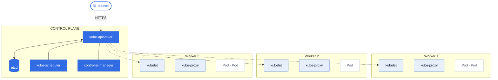
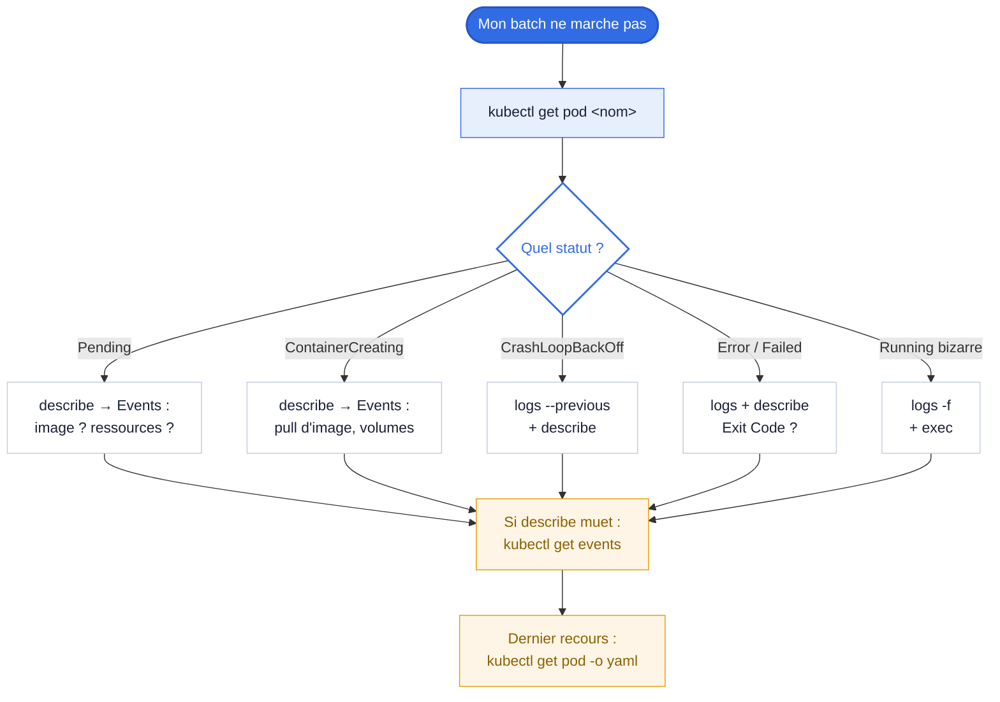
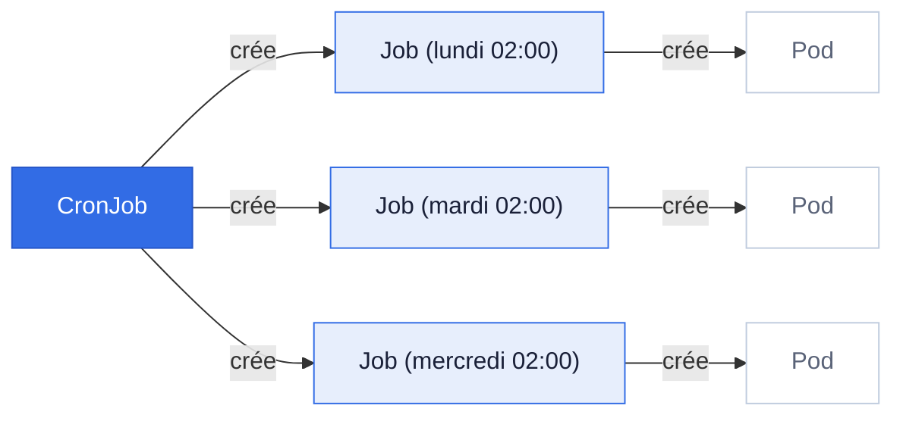
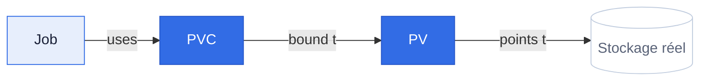
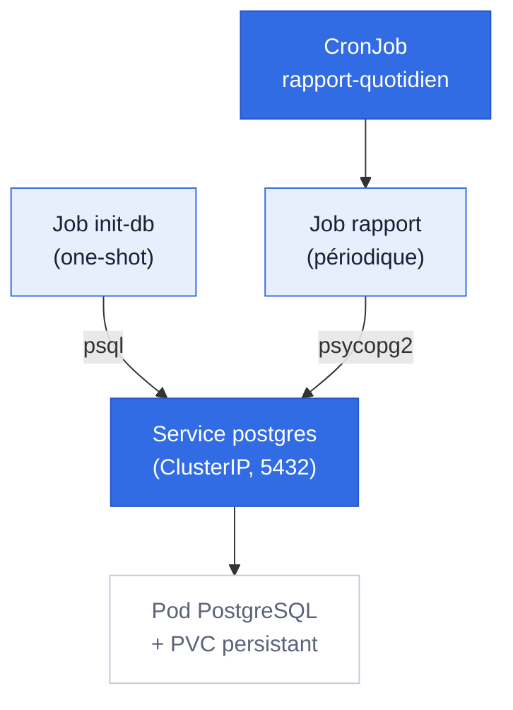

<!--
TODO cover slide: remplacer les valeurs ci-dessous (nom, contact, session).
-->

<div class="cover-wrap">

<div class="cover-wheel">⎈</div>

<h1 class="cover-title">Formation Kubernetes</h1>

<p class="cover-tagline">Workloads Batch & Troubleshooting</p>

<div class="cover-meta">
  <span class="label">Formateur</span><span><strong>Mohamed Hedi CHLAGOU</strong></span>
  <span class="label">Contact</span><code>chlagoumedhedi@outlook.com</code>
  <span class="label">Session</span><span>29 &amp; 30 Juin 2026</span>
  <span class="label">Durée</span><span>2 jours (14h)</span>
</div>

</div>

<div class="cover-nav-hint">
flèches / espace pour naviguer · <kbd>o</kbd> vue d'ensemble · <kbd>f</kbd> plein écran
</div>

---
layout: default
---

# Sommaire - Jour 1

<div class="grid grid-cols-2 gap-6 pt-4">

<div>

### Fondamentaux

- **Module 1** : Introduction à Kubernetes
- **Module 2** : kubectl
- **Module 3** : Les Pods
- **Module 4** : Logs & inspection
- **Module 5** : Namespaces, Labels, Services

</div>
<div>

### Pédagogie

- Théorie courte, beaucoup de pratique
- Cluster local `kind` (1 control-plane + 2 workers)
- Focus **batch**, pas d'exposition web
- Pauses toutes les ~1h30

</div>
</div>

---
layout: section
---

# Module 1

Introduction à Kubernetes · **1h**

---

# 1.1 Rappel : qu'est-ce qu'un conteneur ?

Un **conteneur** est un processus isolé qui embarque son application
**et toutes ses dépendances** (bibliothèques, binaires, configuration)
dans une **image**.

Contrairement à une VM, il partage le noyau de la machine hôte, donc **léger et rapide**.

<div class="pt-4">

|                            | VM                        | Conteneur                           |
| -------------------------- | ------------------------- | ----------------------------------- |
| Démarrage                  | minutes                   | **secondes**                        |
| Taille                     | Go                        | **Mo**                              |
| Isolation                  | complète (OS entier)      | processus (namespaces + cgroups)    |
| Densité sur un serveur     | faible                    | **forte**                           |

</div>

<div class="pt-4 text-sm opacity-70">
Un conteneur seul = Docker. Des centaines à orchestrer, répartir, redémarrer ?
Il faut un <strong>orchestrateur</strong>.
</div>

---

# 1.2 Qu'est-ce que Kubernetes ?

<div class="grid grid-cols-[1fr_2fr] gap-8 pt-4">

<div class="text-8xl font-bold opacity-20 text-center">
  K8s
</div>

<div>

**Kubernetes** (K · 8 lettres · s) est un orchestrateur de conteneurs
open-source, initialement développé par Google, aujourd'hui maintenu
par la **CNCF**.

<div class="pt-4 callout-k8s">

**Le modèle déclaratif, en une phrase :**
vous déclarez **ce que vous voulez** (état désiré),
Kubernetes **fait en sorte que ce soit le cas** et **le maintient**.

</div>

</div>
</div>

<div class="pt-6">

> 🎯 **Exemple** : « Je veux 3 exécutions parallèles de mon batch. »
> Si un nœud crashe pendant l'exécution, K8s relance l'exécution
> manquante sur un autre nœud, **sans intervention**.

</div>

---
layout: two-cols-header
---

# 1.3 Architecture d'un cluster

Un cluster = **control plane** (cerveau) + **worker nodes** (exécutants).

::left::

### Control plane

- **kube-apiserver** : point d'entrée unique (HTTPS). Tous les `kubectl` lui parlent.
- **etcd** : base clé-valeur, état complet du cluster.
- **kube-scheduler** : décide sur quel nœud placer un nouveau Pod.
- **kube-controller-manager** : boucles de contrôle (« si un Pod manque, en recréer un »).

::right::

### Worker nodes

- **kubelet** : agent local, parle à l'apiserver, lance les conteneurs.
- **kube-proxy** : gère le réseau local du nœud.
- **Container runtime** : containerd, CRI-O, exécute les conteneurs.

---

# 1.3 Architecture visuelle



---

# 1.4 Les objets Kubernetes

Un **objet** = entité persistante dans le cluster.
Les plus importants pour cette formation :

| Objet                        | Rôle                                                          | Module |
| ---------------------------- | ------------------------------------------------------------- | :----: |
| **Pod**                      | Plus petite unité, 1+ conteneurs partageant réseau/volume     |   3    |
| **Namespace**                | Regroupement logique d'objets                                 |   5    |
| **Job**                      | Exécute une tâche jusqu'à complétion                          |   6    |
| **CronJob**                  | Exécute un Job selon une planification                        |   7    |
| **ConfigMap**                | Données de configuration non-sensibles                        |   8    |
| **Secret**                   | Données sensibles (mots de passe, tokens)                     |   8    |
| **PersistentVolume / Claim** | Stockage persistant                                           |   9    |

<div class="pt-4 callout-warn text-sm">

📝 Hors-scope : <code>Ingress</code>, <code>Service LoadBalancer</code>, certificats TLS applicatifs.
Focus formation = <strong>batch (Job + CronJob)</strong>.

</div>

---

# 1.5 Modèle déclaratif : le YAML

Presque tout dans Kubernetes se décrit en YAML.

```yaml {all|1|2|3-4|5-9|all}{lines:true}
apiVersion: v1
kind: Pod
metadata:
  name: mon-pod
spec:
  containers:
    - name: mon-conteneur
      image: alpine:3.19
      command: ["echo", "Hello Kubernetes"]
```

<div class="pt-2">

**Les 4 blocs à toujours retenir :**

1. `apiVersion` : version de l'API utilisée
2. `kind` : type d'objet
3. `metadata` : nom, labels, namespace
4. `spec` : ce qu'on veut que l'objet fasse

</div>

---
layout: center
---

# 1.6 Quiz de fin de module

<script setup>
const quizM1 = [
  {
    q: 'Quelle est la différence fondamentale entre un conteneur et une VM ?',
    choices: [
      { t: 'Le conteneur partage le kernel de l\'hôte, la VM embarque un OS complet', ok: true },
      { t: 'Le conteneur embarque son propre noyau, la VM partage celui de l\'hôte' },
      { t: 'La VM démarre en secondes, le conteneur en minutes' },
      { t: 'Un conteneur ne peut héberger qu\'un seul processus' }
    ],
    explain: 'Le partage du kernel est la clé : démarrage en secondes, empreinte en Mo, forte densité sur un serveur.'
  },
  {
    q: 'Parmi ces composants, lequel N\'appartient PAS au control plane ?',
    choices: [
      { t: 'etcd' },
      { t: 'kube-scheduler' },
      { t: 'kubelet', ok: true },
      { t: 'kube-apiserver' }
    ],
    explain: 'kubelet tourne sur chaque worker node : c\'est l\'agent qui reçoit les ordres de l\'apiserver et lance les conteneurs.'
  },
  {
    q: 'Qu\'est-ce que l\'« état désiré » en Kubernetes ?',
    choices: [
      { t: 'L\'état actuel du cluster à un instant T' },
      { t: 'La configuration que l\'on déclare et que K8s s\'efforce de maintenir', ok: true },
      { t: 'Un snapshot de sauvegarde du cluster' },
      { t: 'La liste des erreurs en cours' }
    ],
    explain: 'Modèle déclaratif : vous décrivez ce que vous voulez, la reconciliation loop fait converger le réel vers le déclaré.'
  },
  {
    q: 'Quel composant décide sur quel nœud un nouveau Pod va tourner ?',
    choices: [
      { t: 'kube-apiserver' },
      { t: 'kube-scheduler', ok: true },
      { t: 'kubelet' },
      { t: 'etcd' }
    ],
    explain: 'Le scheduler évalue ressources, contraintes et affinités, puis assigne le Pod à un nœud.'
  },
  {
    q: 'Quand vous tapez une commande `kubectl`, quel composant reçoit la requête ?',
    choices: [
      { t: 'etcd directement' },
      { t: 'kube-scheduler' },
      { t: 'kubelet du nœud local' },
      { t: 'kube-apiserver, via HTTPS', ok: true }
    ],
    explain: 'L\'apiserver est le point d\'entrée unique du cluster. Toutes les actions passent par lui.'
  },
  {
    q: 'Sur un worker node, quel composant lance et surveille réellement les conteneurs ?',
    choices: [
      { t: 'kube-scheduler' },
      { t: 'kubelet', ok: true },
      { t: 'kube-controller-manager' },
      { t: 'etcd' }
    ],
    explain: 'Le kubelet est l\'agent présent sur chaque nœud : il reçoit les specs de Pods et pilote le runtime pour démarrer et surveiller les conteneurs.'
  },
  {
    q: 'Quel rôle joue etcd dans un cluster Kubernetes ?',
    choices: [
      { t: 'Exécuter les conteneurs' },
      { t: 'Stocker l\'état du cluster sous forme clé-valeur', ok: true },
      { t: 'Router le trafic réseau entre Pods' },
      { t: 'Distribuer les images de conteneurs' }
    ],
    explain: 'etcd est la base clé-valeur qui conserve TOUT l\'état du cluster. Sa sauvegarde est critique : la perdre, c\'est perdre le cluster.'
  },
  {
    q: 'Vous supprimez à la main un Pod géré par un contrôleur. Que fait Kubernetes ?',
    choices: [
      { t: 'Rien, le Pod reste supprimé' },
      { t: 'Il recrée un Pod pour revenir à l\'état désiré', ok: true },
      { t: 'Il met le cluster en erreur' },
      { t: 'Il attend une validation manuelle' }
    ],
    explain: 'C\'est la boucle de réconciliation : le contrôleur compare en continu réel et désiré, et recrée ce qui manque. C\'est le « self-healing ».'
  },
  {
    q: 'Quelle est la plus petite unité déployable en Kubernetes ?',
    choices: [
      { t: 'Le conteneur' },
      { t: 'Le Pod', ok: true },
      { t: 'Le nœud' },
      { t: 'Le Deployment' }
    ],
    explain: 'On ne déploie jamais un conteneur seul : il est toujours encapsulé dans un Pod, qui est l\'unité de planification de base.'
  },
  {
    q: 'Pourquoi utiliser un orchestrateur comme Kubernetes plutôt que de lancer ses conteneurs à la main ?',
    choices: [
      { t: 'Pour rendre les conteneurs plus rapides' },
      { t: 'Pour automatiser placement, redémarrage, montée en charge et résilience', ok: true },
      { t: 'Parce que Docker est obsolète' },
      { t: 'Pour supprimer le besoin de serveurs' }
    ],
    explain: 'À l\'échelle, gérer manuellement le placement, les pannes et le scaling devient impossible. L\'orchestrateur industrialise tout cela.'
  }
]
</script>

<Quiz :questions="quizM1" />

---
layout: default
---

# 1.7 Mise en place du cluster (kind)

`kind` lance un cluster Kubernetes **dans des conteneurs Docker** : jetable, reproductible, identique pour tous. C'est l'environnement de **tous les TP**.

<div class="ex-grid grid grid-cols-[3fr_2fr] gap-4 pt-2">
<div>

**Prérequis** : `docker`, `kind` (≥ 0.20) et `kubectl` installés.

**1. Décrire le cluster** : `kind-config.yaml`

```yaml
kind: Cluster
apiVersion: kind.x-k8s.io/v1alpha4
name: formation
nodes:
  - role: control-plane
  - role: worker
  - role: worker
```

**2. Créer, puis vérifier**

```bash
kind create cluster --config kind-config.yaml
kubectl get nodes          # 3 nœuds Ready
```

</div>
<div>

<div class="callout-k8s text-sm">

**Pourquoi 3 nœuds ?**

1 control-plane + 2 workers : on voit le **scheduler** répartir les Pods, au plus proche d'un vrai cluster.

</div>

<div class="callout-ok text-sm pt-3">

**StorageClass `standard`** fournie d'office → les PVC des TP fonctionnent sans rien installer.

</div>

<div class="callout-warn text-sm pt-3">

Image locale → la charger sur les nœuds :
`kind load docker-image  --name formation`

</div>

</div>
</div>

---
layout: default
---

# 1.8 Préparer le cluster pour les TP

Un **namespace de travail** dédié (et, en option, les métriques). À faire **une seule fois** après la création du cluster.

<div class="ex-grid grid grid-cols-[3fr_2fr] gap-4 pt-2">
<div>

**Namespace `formation` par défaut**

```bash
kubectl create namespace formation
kubectl config set-context --current \
  --namespace=formation
```

**Métriques (optionnel), pour `kubectl top`**

```bash
kubectl apply -f https://github.com/kubernetes-sigs/\
metrics-server/releases/latest/download/components.yaml

# kind : autoriser le kubelet en TLS non vérifié
kubectl -n kube-system patch deploy metrics-server \
  --type=json -p='[{"op":"add",
  "path":"/spec/template/spec/containers/0/args/-",
  "value":"--kubelet-insecure-tls"}]'
```

</div>
<div>

<div class="callout-k8s text-sm">

**Vérifier que tout est prêt**

- `kubectl get nodes` → 3 `Ready`
- `kubectl get ns formation`
- `kubectl top nodes` (si metrics-server)

</div>

<div class="callout-warn text-sm pt-3">

**Fin de formation**, tout jeter :
`kind delete cluster --name formation`

`metrics-server` met ~1 min ; sans lui, `kubectl top` renvoie une erreur : c'est **normal**.

</div>

</div>
</div>

---
layout: center
class: text-center
---

# Fin du Module 1

Prochaine étape : **Module 2 : kubectl**

<div class="pt-6 text-sm opacity-60">
Pause 15 min ☕
</div>

---
layout: section
---

# Module 2

kubectl · **1h**

---

# 2.1 Le client en ligne de commande

`kubectl` est **le** client pour parler à un cluster. Toutes les actions passent par lui.

<div class="pt-4 callout-k8s">

**Pattern universel :**

```
kubectl <VERBE> <TYPE-OBJET> [NOM] [FLAGS]
```

</div>

<div class="pt-4">

**Exemples canoniques :**

```bash
kubectl get pods                        # lister les Pods
kubectl describe pod mon-pod            # voir le détail
kubectl delete pod mon-pod              # supprimer
kubectl apply -f fichier.yaml           # appliquer un manifest (à privilégier)
```

</div>

---

# 2.2 Le fichier kubeconfig

`kubectl` lit ses informations de connexion dans `~/.kube/config`.

<div class="grid grid-cols-2 gap-6 pt-4">

<div>

### Contenu

- **clusters** : URL apiserver + certificat
- **users** : identifiants (cert, token)
- **contexts** : cluster + user + namespace par défaut

</div>

<div>

### Commandes utiles

```bash
kubectl config view
kubectl config get-contexts
kubectl config current-context
kubectl config use-context kind-formation
kubectl config set-context --current \
  --namespace=batchs
```

</div>

</div>

---

# 2.3 Les verbes les plus utilisés

| Verbe       | Action                                                        |
| ----------- | ------------------------------------------------------------- |
| `get`       | lister (court ou large avec `-o wide`)                        |
| `describe`  | détails lisibles d'un objet                                   |
| `create`    | créer un objet (impératif)                                    |
| **`apply`** | créer OU mettre à jour depuis fichier (**à privilégier**)     |
| `delete`    | supprimer                                                     |
| `logs`      | lire les logs d'un conteneur                                  |
| `exec`      | exécuter une commande dans un conteneur                       |
| `edit`      | éditer un objet en direct (`$EDITOR`)                         |
| `explain`   | obtenir la doc d'un champ YAML                                |

<div class="pt-3 text-sm opacity-70">
<code>kubectl explain pod.spec.containers.resources</code> vous évite de chercher sur le web.
</div>

---

# 2.4 Formats de sortie

```bash {all|1|2|3|4|5|all}
kubectl get pods                                    # format par défaut
kubectl get pods -o wide                            # + IP, nœud
kubectl get pod mon-pod -o yaml                     # YAML complet
kubectl get pod mon-pod -o json                     # JSON
kubectl get pods -o jsonpath='{.items[*].metadata.name}'  # extraction ciblée
```

<div class="pt-4 callout-k8s">

**Format custom-columns** : très pratique pour des tableaux d'exploitation.

```bash
kubectl get pods -o custom-columns=NAME:.metadata.name,\
STATUS:.status.phase,NODE:.spec.nodeName
```

</div>

---

# 2.5 Alias et auto-complétion

La vie est trop courte pour taper `kubectl` toute la journée :

```bash {all|1-3|5-6|all}
# Bash
echo 'alias k=kubectl' >> ~/.bashrc
echo 'source <(kubectl completion bash)' >> ~/.bashrc
echo 'complete -o default -F __start_kubectl k' >> ~/.bashrc

# Zsh
echo 'alias k=kubectl' >> ~/.zshrc
echo 'source <(kubectl completion zsh)' >> ~/.zshrc
```

<div class="pt-4 text-sm opacity-70">
Après ça : <code>k get po</code> → <code>kubectl get pods</code> (alias <code>k</code> + nom court <code>po</code>). La complétion <kbd>↹</kbd> finit verbes et ressources au fil de la frappe.
Prenez 2 min pour le configurer maintenant, vous allez gagner des heures.
</div>

---

# 💻 Exercice 2.1 - Prise en main

**Objectif** : vérifier que votre cluster fonctionne.

<div class="grid grid-cols-2 gap-6 pt-4">

<div>

### Checklist

```bash
kubectl cluster-info
kubectl get nodes
kubectl get nodes -o wide
kubectl get namespaces
kubectl get pods -A
kubectl describe node <nom>
```

</div>

<div>

### Questions

- Combien de nœuds ?
- Quelle version de Kubernetes ?
- Combien de pods dans `kube-system` ?
- Que fait le Pod `coredns` ?

</div>

</div>

---
layout: default
---

# 💻 Exercice 2.2 - Créer le namespace de formation

**Scénario** : tout au long des 2 jours, on travaillera dans un namespace dédié `formation`. Le créer et basculer le contexte sur ce namespace.

<div class="ex-grid grid grid-cols-[3fr_2fr] gap-4 pt-2">
<div>

```bash
# 1. Création
kubectl create namespace formation

# 2. Vérification
kubectl get ns
# NAME              STATUS   AGE
# default           Active   ...
# formation         Active   ...  ← nouveau
# kube-node-lease   Active   ...
# kube-public       Active   ...
# kube-system       Active   ...

# 3. Basculer le contexte
kubectl config set-context --current \
  --namespace=formation

# 4. Vérifier le contexte actif
kubectl config view --minify \
  | grep namespace
# namespace: formation
```

</div>
<div>

**Effet**

Plus besoin de répéter `-n formation` à chaque commande.

```bash
# Avant
kubectl get pods -n formation

# Après (même résultat)
kubectl get pods
```

<div class="callout-k8s text-xs pt-1">
💡 <strong>Bonne pratique</strong> : jamais travailler dans <code>default</code>. Un namespace par projet / équipe / environnement.
</div>

<div class="callout-warn text-xs pt-1">
⚠️ Pour supprimer : <code>kubectl delete ns formation</code> supprime <strong>tout</strong> ce qu'il contient en cascade.
</div>

</div>
</div>

---
layout: center
---

# 2.6 Quiz

<script setup>
const quizM2 = [
  {
    q: 'Quel verbe kubectl faut-il privilégier pour créer ou mettre à jour un objet depuis un fichier YAML ?',
    choices: [
      { t: 'kubectl create' },
      { t: 'kubectl apply', ok: true },
      { t: 'kubectl edit' },
      { t: 'kubectl patch' }
    ],
    explain: 'apply est déclaratif : il crée si absent, met à jour si présent. create est impératif et échoue si l\'objet existe déjà.'
  },
  {
    q: 'Pour connaître la structure d\'un champ YAML sans quitter le terminal :',
    choices: [
      { t: 'kubectl describe pod' },
      { t: 'kubectl get pod -o yaml' },
      { t: 'kubectl explain pod.spec.containers', ok: true },
      { t: 'kubectl docs pod' }
    ],
    explain: 'explain lit directement le schéma OpenAPI de l\'apiserver. Pratique sur un cluster sans internet.'
  },
  {
    q: 'Où sont stockées les informations de connexion au cluster par défaut ?',
    choices: [
      { t: '/etc/kubernetes/config' },
      { t: '~/.kube/config', ok: true },
      { t: '/var/lib/kubelet/config' },
      { t: '$KUBECTL_HOME/config' }
    ],
    explain: '~/.kube/config contient clusters, users et contexts. Variable KUBECONFIG possible pour plusieurs fichiers.'
  },
  {
    q: 'Comment lister les Pods de tous les namespaces ?',
    choices: [
      { t: 'kubectl get pods --all' },
      { t: 'kubectl get pods -A', ok: true },
      { t: 'kubectl get all pods' },
      { t: 'kubectl get -n=* pods' }
    ],
    explain: '-A est le raccourci de --all-namespaces, très utile en exploitation.'
  },
  {
    q: 'Quelle option de kubectl get pods affiche le nœud et l\'IP de chaque Pod ?',
    choices: [
      { t: '-o yaml' },
      { t: '-o wide', ok: true },
      { t: '--verbose' },
      { t: '-o nodes' }
    ],
    explain: '-o wide ajoute des colonnes (NODE, IP...) sans basculer en YAML complet. Idéal pour un coup d\'œil rapide en exploitation.'
  },
  {
    q: 'Par défaut, dans quel namespace s\'exécute une commande kubectl sans option -n ?',
    choices: [
      { t: 'kube-system' },
      { t: 'default', ok: true },
      { t: 'le dernier namespace créé' },
      { t: 'tous les namespaces' }
    ],
    explain: 'Sans -n ni contexte particulier, kubectl cible le namespace default. On peut changer ce défaut avec kubectl config set-context.'
  },
  {
    q: 'Comment supprimer tous les objets décrits dans un fichier mon-app.yaml ?',
    choices: [
      { t: 'kubectl remove -f mon-app.yaml' },
      { t: 'kubectl delete -f mon-app.yaml', ok: true },
      { t: 'kubectl apply --delete mon-app.yaml' },
      { t: 'kubectl destroy mon-app.yaml' }
    ],
    explain: 'delete -f lit le même fichier que apply et supprime exactement les objets qu\'il déclare. Pratique pour un cleanup propre.'
  },
  {
    q: 'Comment générer le YAML d\'un Pod sans réellement le créer dans le cluster ?',
    choices: [
      { t: 'kubectl run nginx --image=nginx --dry-run=client -o yaml', ok: true },
      { t: 'kubectl run nginx --image=nginx --preview' },
      { t: 'kubectl create pod nginx --fake' },
      { t: 'kubectl get pod nginx -o yaml' }
    ],
    explain: '--dry-run=client construit l\'objet localement et -o yaml l\'imprime : la méthode reine pour générer un squelette de manifeste.'
  },
  {
    q: 'Vous jonglez entre un cluster de dev et un de prod. Quelle commande change de cluster actif ?',
    choices: [
      { t: 'kubectl switch prod' },
      { t: 'kubectl config use-context prod', ok: true },
      { t: 'kubectl set cluster prod' },
      { t: 'kubectl context prod' }
    ],
    explain: 'Un contexte associe cluster + user + namespace. use-context bascule l\'ensemble en une commande.'
  },
  {
    q: 'Quelle option suit en direct (streaming) les logs d\'un Pod ?',
    choices: [
      { t: 'kubectl logs mon-pod --tail' },
      { t: 'kubectl logs mon-pod --watch' },
      { t: 'kubectl logs -f mon-pod', ok: true },
      { t: 'kubectl logs mon-pod --stream' }
    ],
    explain: '-f (follow) garde la sortie ouverte et affiche les nouvelles lignes en continu, comme tail -f.'
  }
]
</script>

<Quiz :questions="quizM2" />

---
layout: center
class: text-center
---

# Fin du Module 2

Prochaine étape : **Module 3 : Les Pods**

---
layout: section
---

# Module 3

Les Pods, brique de base · **2h**

---

# 3.1 Qu'est-ce qu'un Pod ?

Le **Pod** est la plus petite unité manipulable par Kubernetes.
Ce n'est **PAS** un conteneur : c'est un **groupe de 1+ conteneurs** qui :

<div class="pt-4">

- partagent le même **réseau** (même IP, mêmes ports)
- partagent les mêmes **volumes**
- sont toujours schedulés sur le **même nœud**
- naissent et meurent **ensemble**

</div>

<div class="pt-6 callout-k8s">

💡 Dans **90 %** des cas, un Pod = un conteneur. Le multi-conteneurs sert
surtout au pattern **sidecar** (app principale + conteneur qui collecte les logs).

</div>

<div class="pt-4 text-sm opacity-70">
Pour nos batchs : un Pod = UN conteneur qui exécute le traitement, puis termine.
</div>

---

# 3.2 Cycle de vie d'un Pod

Un Pod passe par plusieurs **phases** (champ `status.phase`) :

| Phase         | Signification                                                            |
| ------------- | ------------------------------------------------------------------------ |
| `Pending`     | Accepté mais pas encore en exécution (image, ressources…)                |
| `Running`     | Sur un nœud, au moins un conteneur tourne                                |
| `Succeeded`   | Tous les conteneurs ont terminé avec **succès** (exit 0)                 |
| `Failed`      | Au moins un conteneur a terminé **en erreur** (exit ≠ 0)                 |
| `Unknown`     | L'état ne peut pas être déterminé (problème kubelet)                     |

<div class="pt-4 callout-k8s text-sm">

Pour les batchs, les phases finales intéressantes sont <strong>Succeeded</strong> et <strong>Failed</strong>.
Attention : <code>kubectl get pods</code> affiche <code>Completed</code> (phase <code>Succeeded</code>) et <code>Error</code> (phase <code>Failed</code>) dans la colonne STATUS.

</div>

---

# 3.3 Créer un Pod : impératif vs déclaratif

<div class="grid grid-cols-2 gap-6 pt-4">

<div>

### Impératif (one-shot)

```bash
kubectl run mon-pod \
  --image=alpine:3.19 \
  --restart=Never \
  -- echo "Hello"
```

Rapide, mais **pas reproductible**.
À éviter en production.

</div>

<div>

### Déclaratif (bonne pratique)

```yaml
apiVersion: v1
kind: Pod
metadata:
  name: hello-batch
  labels:
    app: demo
    type: batch
spec:
  restartPolicy: Never
  containers:
    - name: hello
      image: alpine:3.19
```

`kubectl apply -f pod.yaml`

</div>

</div>

---

# 3.4 Le champ restartPolicy

**Crucial** pour les batchs. Trois valeurs possibles :

| Valeur       | Comportement                                                       | Usage typique                |
| ------------ | ------------------------------------------------------------------ | ---------------------------- |
| `Always`     | Redémarre **toujours** (même après succès). **Défaut.**            | Serveurs longue durée        |
| `OnFailure`  | Redémarre seulement si exit ≠ 0                                    | Batchs avec retry            |
| `Never`      | Ne redémarre **jamais**                                            | Batchs one-shot, debug       |

<div class="pt-4 callout-warn">

⚠️ Un batch avec <code>restartPolicy: Always</code> (défaut !) sera relancé
en boucle après son succès → <code>CrashLoopBackOff</code>.
<strong>Erreur classique n°1.</strong>

</div>

---

# 💻 Exercice 3.1 - Premier Pod batch

```yaml
apiVersion: v1
kind: Pod
metadata:
  name: calcul-somme
  labels: {app: formation, type: batch}
spec:
  restartPolicy: Never
  containers:
    - name: calculateur
      image: python:3.12-alpine
      command: ["python", "-c"]
      args:
        - |
          total = sum(range(1, 101))
          print(f"La somme de 1 à 100 vaut {total}")
```

<div class="pt-3 text-sm">

**Workflow** : `kubectl apply -f pod.yaml` → `kubectl get pods -w` → `kubectl logs calcul-somme`

Vous verrez typiquement : `Pending` → `ContainerCreating` → `Running` → `Completed`.

</div>

---
layout: default
---

# 💻 Exercice 3.2 - Batch de traitement simulé

**Scénario** : simuler un batch qui traite 20 items en affichant sa progression et suivre ses logs en temps réel.

<div class="ex-grid grid grid-cols-[3fr_2fr] gap-4 pt-2">
<div>

```yaml
apiVersion: v1
kind: Pod
metadata:
  name: traitement-items
  labels: {app: formation, type: batch, criticite: basse}
spec:
  restartPolicy: Never
  containers:
    - name: worker
      image: alpine:3.19
      command: ["sh", "-c"]
      args:
        - |
          NB=20
          echo "[$(date +%H:%M:%S)] Début - $NB items"
          for i in $(seq 1 $NB); do
            sleep 1
            echo "[$(date +%H:%M:%S)] Item $i/$NB traité"
          done
          echo "[$(date +%H:%M:%S)] Terminé"
```

</div>
<div>

**Actions**

```bash
kubectl apply -f pod-traitement.yaml

# Dans un 2e terminal : suivi live
kubectl logs -f traitement-items

# Statut final
kubectl get pod traitement-items
# → STATUS: Completed
```

**À observer**

- Logs arrivent en flux continu avec `-f`
- Les logs restent accessibles **après** la fin du Pod (tant qu'il n'est pas supprimé)
- `kubectl logs` fonctionne encore une fois le Pod terminé

</div>
</div>

---
layout: default
---

# 💻 Exercice 3.3 - Un batch qui échoue

**Scénario** : observer le comportement d'un Pod qui sort avec un exit code non nul, puis tester avec `restartPolicy: OnFailure`.

<div class="ex-grid grid grid-cols-[3fr_2fr] gap-4 pt-2">
<div>

```yaml
apiVersion: v1
kind: Pod
metadata:
  name: batch-en-echec
spec:
  restartPolicy: Never       # puis tester avec OnFailure
  containers:
    - name: worker
      image: alpine:3.19
      command: ["sh", "-c"]
      args:
        - |
          echo "Je démarre..."
          sleep 3
          echo "Quelque chose tourne mal !"
          exit 42
```

</div>
<div>

**Actions**

```bash
kubectl apply -f pod-echec.yaml

# Après ~5 s
kubectl get pod batch-en-echec
# → STATUS: Error

kubectl describe pod batch-en-echec \
  | grep -A 2 "Exit Code"
# → Exit Code: 42
```

**Variation**

Passer `restartPolicy: Never` → `OnFailure`,
recréer le Pod, observer :

- le conteneur redémarre en boucle
- statut passe à `CrashLoopBackOff`

**→ piège classique** des batchs sans `Never`.

</div>
</div>

---
layout: default
---

# 3.5 Variables d'environnement

On passe souvent des paramètres à un batch via les variables d'env :

```yaml {all|6-11}
apiVersion: v1
kind: Pod
metadata:
  name: pod-env
spec:
  restartPolicy: Never
  containers:
    - name: app
      image: alpine:3.19
      env:
        - name: CLIENT
          value: "ACME"
        - name: DATE_TRAITEMENT
          value: "2026-04-17"
      command: ["sh", "-c"]
      args:
        - 'echo "Traitement pour $CLIENT du $DATE_TRAITEMENT"'
```

<div class="pt-3 text-sm opacity-70">
Au Module 8 : on externalisera dans des ConfigMaps / Secrets.
</div>

---
layout: default
---

# 💻 Exercice 3.4 - Paramétrage par variables

**Scénario** : faire varier le comportement d'un batch en éditant ses variables d'env, puis comprendre l'immutabilité du Pod.

<div class="ex-grid grid grid-cols-[3fr_2fr] gap-4 pt-2">
<div>

```yaml
apiVersion: v1
kind: Pod
metadata: {name: batch-parametre}
spec:
  restartPolicy: Never
  containers:
    - name: worker
      image: alpine:3.19
      env:
        - {name: NB_ITERATIONS, value: "5"}
        - {name: INTERVALLE_SEC, value: "2"}
      command: ["sh", "-c"]
      args:
        - |
          echo "Config: $NB_ITERATIONS × $INTERVALLE_SEC s"
          i=1
          while [ $i -le $NB_ITERATIONS ]; do
            echo "Itération $i"
            sleep $INTERVALLE_SEC
            i=$((i+1))
          done
```

</div>
<div>

**Actions**

1. Appliquer, observer les logs.
2. Éditer le YAML : `NB_ITERATIONS=10`, `INTERVALLE_SEC=1`.
3. `kubectl apply -f` → **erreur** : le champ `env` est immutable.
4. Solution :
   ```bash
   kubectl delete pod batch-parametre
   kubectl apply -f pod-param.yaml
   ```

**Question**

Pourquoi faut-il supprimer avant de réappliquer ?

<div class="callout-k8s text-xs pt-1">
Un Pod est largement immutable. Beaucoup de champs (dont <code>env</code>) ne peuvent pas être modifiés à chaud. Pour modifier : on supprime + on recrée.
</div>

</div>
</div>

---

# 3.6 À retenir

<div class="grid grid-cols-2 gap-6 pt-4">

<div class="callout-k8s">

### Règles d'or

- Un **Pod** = 1 ou plusieurs conteneurs solidaires
- Pour un batch : `restartPolicy: Never` ou `OnFailure`
- Un Pod est **largement immutable** : pour modifier, on supprime + recrée
- Les logs d'un Pod terminé restent **tant que le Pod existe**

</div>

<div class="callout-warn">

### Limite fondamentale

Un Pod seul n'est **pas résilient** :

- Si le nœud meurt, le Pod disparaît
- Pas de retry automatique
- Pas de parallélisme natif

**→ Module 6 : le Job résout tout ça.**

</div>

</div>

---
layout: center
---

# 3.7 Quiz

<script setup>
const quizM3 = [
  {
    q: 'Un Pod contient deux conteneurs. Sur combien de nœuds différents peuvent-ils tourner ?',
    choices: [
      { t: 'Un par nœud (répartis pour la haute disponibilité)' },
      { t: 'Toujours sur le même nœud', ok: true },
      { t: 'Selon le scheduler, cela dépend' },
      { t: 'Deux maximum' }
    ],
    explain: 'Les conteneurs d\'un Pod partagent réseau et volumes, ils DOIVENT être co-localisés sur un même nœud.'
  },
  {
    q: 'Votre batch démarre bien mais reboucle à l\'infini après son succès. Cause la plus probable ?',
    choices: [
      { t: 'L\'image du conteneur est corrompue' },
      { t: 'restartPolicy est resté à Always (valeur par défaut)', ok: true },
      { t: 'Le cluster est saturé' },
      { t: 'Le Pod a un CrashLoop défini' }
    ],
    explain: 'Always est le défaut : Kubernetes relance le conteneur MÊME après un exit 0. Pour un batch : Never ou OnFailure.'
  },
  {
    q: 'Vous modifiez la variable d\'env d\'un Pod existant. Comment appliquer le changement ?',
    choices: [
      { t: 'kubectl edit pod pour changer env' },
      { t: 'kubectl apply sur le fichier modifié' },
      { t: 'Supprimer le Pod et le recréer', ok: true },
      { t: 'kubectl patch avec le nouveau env' }
    ],
    explain: 'Le champ env est IMMUTABLE sur un Pod existant. La règle : pour modifier, on supprime et on recrée.'
  },
  {
    q: 'Quelle phase indique qu\'un Pod a terminé son exécution avec succès ?',
    choices: [
      { t: 'Running' },
      { t: 'Completed' },
      { t: 'Succeeded', ok: true },
      { t: 'Done' }
    ],
    explain: 'Succeeded = phase officielle. Completed est affiché par kubectl get mais la valeur status.phase est Succeeded.'
  },
  {
    q: 'Deux conteneurs dans le même Pod : comment communiquent-ils le plus simplement ?',
    choices: [
      { t: 'Via le Service du Pod' },
      { t: 'Via localhost et un port partagé', ok: true },
      { t: 'Via l\'IP publique du nœud' },
      { t: 'Ils ne peuvent pas communiquer' }
    ],
    explain: 'Les conteneurs d\'un Pod partagent la même interface réseau : ils se joignent sur localhost:port. C\'est la base du pattern sidecar.'
  },
  {
    q: 'À quoi sert un initContainer ?',
    choices: [
      { t: 'Accélérer le démarrage du conteneur principal' },
      { t: 'Exécuter une tâche préalable qui doit réussir avant les conteneurs applicatifs', ok: true },
      { t: 'Redémarrer le Pod en cas de crash' },
      { t: 'Servir de conteneur de secours' }
    ],
    explain: 'Les initContainers s\'exécutent séquentiellement jusqu\'au succès avant que les conteneurs normaux démarrent : parfait pour attendre une dépendance ou préparer un volume.'
  },
  {
    q: 'Une liveness probe qui échoue de façon répétée provoque quoi ?',
    choices: [
      { t: 'La suppression définitive du Pod' },
      { t: 'Le redémarrage du conteneur', ok: true },
      { t: 'Le retrait du Pod des Endpoints du Service' },
      { t: 'Rien, c\'est purement informatif' }
    ],
    explain: 'La liveness probe vérifie que le process est vivant : en cas d\'échec, kubelet redémarre le conteneur. La readiness, elle, agit sur le routage du Service.'
  },
  {
    q: 'Que devient l\'adresse IP d\'un Pod après sa recréation ?',
    choices: [
      { t: 'Elle est conservée' },
      { t: 'Elle change', ok: true },
      { t: 'Elle devient publique' },
      { t: 'Elle passe à 127.0.0.1' }
    ],
    explain: 'Une IP de Pod est éphémère : chaque recréation en attribue une nouvelle. C\'est précisément pourquoi on s\'adresse à un Service, pas à un Pod.'
  },
  {
    q: 'Que contrôle une readiness probe ?',
    choices: [
      { t: 'Si le conteneur doit être redémarré' },
      { t: 'Si le Pod est prêt à recevoir du trafic', ok: true },
      { t: 'Si l\'image est à jour' },
      { t: 'Si le nœud a assez de mémoire' }
    ],
    explain: 'Tant que la readiness échoue, le Pod est retiré des Endpoints du Service : aucune requête ne lui est envoyée, sans pour autant le redémarrer.'
  },
  {
    q: 'Pour un Pod de traitement batch ponctuel, quelle restartPolicy est adaptée ?',
    choices: [
      { t: 'Always' },
      { t: 'OnFailure ou Never', ok: true },
      { t: 'Reboot' },
      { t: 'Manual' }
    ],
    explain: 'Always relancerait le batch même après un exit 0. OnFailure (relance si échec) ou Never correspondent à une tâche qui doit se terminer.'
  }
]
</script>

<Quiz :questions="quizM3" />

---
layout: center
class: text-center
---

# Fin du Module 3

Prochaine étape : **Module 4 : Logs & inspection**

<div class="pt-6 text-sm opacity-60">Pause 15 min ☕</div>

---
layout: section
---

# Module 4

Logs, inspection et investigations · **1h30**

---

# 4.1 Les 4 outils de base

LE module central pour exploiter des batchs.

<div class="pt-4">

| Commande            | Usage principal                                 |
| ------------------- | ----------------------------------------------- |
| `kubectl get`       | vue d'ensemble rapide (statut, âge)             |
| `kubectl describe`  | détails lisibles + **Events**                   |
| `kubectl logs`      | ce qu'a écrit l'app sur stdout / stderr         |
| `kubectl exec`      | se connecter dans le conteneur (si Running)     |

</div>

<div class="pt-6 callout-k8s">

📋 <strong>Méthodologie universelle</strong> : <code>get</code> → <code>describe</code> → <code>logs</code> → (<code>exec</code>)

</div>

---

# 4.2 kubectl logs, le réflexe n°1

```bash {all|1-2|4-5|7-8|10-11|13-14|16-17|all}
# Simple
kubectl logs <pod>

# Suivre en temps réel (comme tail -f)
kubectl logs -f <pod>

# Les 50 dernières lignes
kubectl logs --tail=50 <pod>

# Avec horodatage
kubectl logs --timestamps <pod>

# Logs d'un pod multi-conteneurs
kubectl logs <pod> -c <conteneur>

# ⚡ Logs de l'instance PRÉCÉDENTE (crashloop)
kubectl logs <pod> --previous
```

<div class="pt-3 callout-k8s text-sm">
<code>--previous</code> (ou <code>-p</code>) est <strong>essentiel</strong>
pour débugguer un Pod qui crashe en boucle.
</div>

---

# 4.3 kubectl describe, le réflexe n°2

`describe` = lecture humaine + les **Events** récents (la pépite).

<div class="grid grid-cols-[1fr_1fr] gap-6 pt-4">

<div>

### Structure de la sortie

- **Metadata** (nom, labels, ns)
- **Status** (phase, IP, nœud)
- **Containers** (image, état, ressources)
- **Conditions** (Scheduled, Ready…)
- **Events** ← **la partie la plus précieuse**

</div>

<div>

### Exemple d'Events parlants

```
Normal   Scheduled  ... assigned to worker-1
Normal   Pulling    Pulling image "python:3.12-alpine"
Normal   Pulled     Successfully pulled (5.2s)
Normal   Created    Created container worker
Warning  Failed     OCI runtime create failed...
```

</div>

</div>

---

# 4.4 kubectl exec : entrer dans le conteneur

Utile pour inspecter l'environnement d'un batch long.

```bash {all|1-3|5-6|8|all}
# Commande unique
kubectl exec <pod> -- ls /tmp
kubectl exec <pod> -- env

# Shell interactif
kubectl exec -it <pod> -- sh

# Si l'image a bash
kubectl exec -it <pod> -- bash
```

<div class="pt-4 callout-warn">

⚠️ On ne peut <code>exec</code> que dans un Pod en phase <strong>Running</strong>.
Pour un batch terminé ou en échec → logs + describe.

</div>

---

# 4.5 Méthodologie de diagnostic



---

# 💻 Exercice 4.1 - Lire les logs d'un batch verbeux

**Scénario** : un Pod affiche 30 lignes mêlées stdout / stderr sur 1 minute. Tester les différents modes de lecture.

<div class="ex-grid grid grid-cols-[3fr_2fr] gap-4 pt-2">
<div>

```yaml
apiVersion: v1
kind: Pod
metadata: {name: batch-verbeux}
spec:
  restartPolicy: Never
  containers:
    - name: worker
      image: alpine:3.19
      command: ["sh", "-c"]
      args:
        - |
          for i in $(seq 1 30); do
            echo "[INFO] Ligne $i - traitement en cours"
            if [ $((i % 5)) -eq 0 ]; then
              echo "[WARN] Étape $i" >&2
            fi
            sleep 2
          done
```

</div>
<div>

**Actions**

```bash
kubectl apply -f batch-verbeux.yaml

# Suivre en direct
kubectl logs -f batch-verbeux

# Dans un 2e terminal
kubectl logs --tail=5 batch-verbeux
kubectl logs --since=10s batch-verbeux
kubectl logs --timestamps batch-verbeux
```

**Question**

Les lignes `[WARN]` apparaissent-elles ?

<div class="callout-k8s text-xs pt-1">
Oui : stderr et stdout sont tous les deux capturés par <code>kubectl logs</code>.
</div>

</div>
</div>

---
layout: default
---

# 💻 Exercice 4.2 - Diagnostiquer un Pod Pending

**Scénario** : demander volontairement des ressources impossibles et lire les Events pour comprendre.

<div class="ex-grid grid grid-cols-[3fr_2fr] gap-4 pt-2">
<div>

```yaml
apiVersion: v1
kind: Pod
metadata: {name: pod-impossible}
spec:
  restartPolicy: Never
  containers:
    - name: gros-worker
      image: alpine:3.19
      command: ["sleep", "300"]
      resources:
        requests:
          memory: "500Gi"     # ← volontairement énorme
          cpu: "200"          # ← 200 vCPU
```

</div>
<div>

**Actions**

```bash
kubectl apply -f pod-impossible.yaml
kubectl get pod pod-impossible
# STATUS: Pending (ne bouge pas)

kubectl describe pod pod-impossible
# → Events:
#   FailedScheduling: Insufficient
#   cpu, memory
```

**Correction**

```yaml
requests:
  memory: "64Mi"
  cpu: "100m"
```

Puis `delete` + `apply`.

<div class="callout-warn text-xs pt-1">
<strong>Pending persistant</strong> = toujours regarder les Events du <code>describe</code>.
</div>

</div>
</div>

---
layout: default
---

# 💻 Exercice 4.3 - Image inexistante

**Scénario** : typo dans le nom d'image, observer le cycle `ErrImagePull` / `ImagePullBackOff`.

<div class="ex-grid grid grid-cols-[3fr_2fr] gap-4 pt-2">
<div>

```yaml
apiVersion: v1
kind: Pod
metadata: {name: pod-mauvaise-image}
spec:
  restartPolicy: Never
  containers:
    - name: worker
      image: alpinnne:3.19   # ← typo volontaire
      command: ["echo", "hello"]
```

</div>
<div>

**Actions**

```bash
kubectl apply -f pod-mauvaise-image.yaml
kubectl get pod pod-mauvaise-image
# STATUS: ErrImagePull
#      → ImagePullBackOff

kubectl describe pod pod-mauvaise-image
# → Events:
#   Failed: Failed to pull image
#   "alpinnne:3.19": rpc error:
#   manifest unknown
```

**À retenir**

`ImagePullBackOff` = kubectl a pull-retry et abandonne temporairement (backoff exponentiel).

Vérifier : **nom**, **tag**, **registry privée** (secrets).

</div>
</div>

---
layout: default
---

# 💻 Exercice 4.4 - Entrer dans un Pod qui tourne

**Scénario** : investiguer l'environnement d'un Pod Running avec `exec`.

<div class="ex-grid grid grid-cols-[3fr_2fr] gap-4 pt-2">
<div>

```yaml
apiVersion: v1
kind: Pod
metadata: {name: pod-long}
spec:
  restartPolicy: Never
  containers:
    - name: worker
      image: alpine:3.19
      command: ["sleep", "3600"]
```

</div>
<div>

**Actions**

```bash
kubectl apply -f pod-long.yaml

# Shell interactif
kubectl exec -it pod-long -- sh

# À l'intérieur :
hostname          # nom du Pod
ip addr           # IP interne
env | sort        # variables d'env
ps aux            # processus
df -h             # volumes montés
exit

# Commande one-shot sans entrer
kubectl exec pod-long \
  -- cat /etc/os-release
```

<div class="callout-warn text-xs pt-1">
<code>exec</code> ne marche <strong>que</strong> sur un Pod <strong>Running</strong>. Pour un Pod Failed : logs + describe seulement.
</div>

</div>
</div>

---

# 4.6 À retenir

<div class="grid grid-cols-2 gap-6 pt-4">

<div class="callout-k8s">

### Les réflexes

1. Toujours commencer par **`get`** → **`describe`** → **`logs`**
2. **`--previous`** pour un Pod qui crashe en boucle
3. **`exec`** uniquement sur un Pod Running
4. Les **Events** dans `describe` sont votre meilleur ami

</div>

<div>

### Commandes supplémentaires

```bash
# Events du namespace entier
kubectl get events \
  --sort-by=.lastTimestamp

# Pods en échec seulement
kubectl get pods \
  --field-selector=status.phase=Failed
```

</div>

</div>

---
layout: center
---

# 4.7 Quiz

<script setup>
const quizM4 = [
  {
    q: 'Votre Pod est en CrashLoopBackOff. Quelle commande lit les logs de la dernière tentative ratée ?',
    choices: [
      { t: 'kubectl logs mon-pod' },
      { t: 'kubectl logs mon-pod --tail=-1' },
      { t: 'kubectl logs mon-pod --previous', ok: true },
      { t: 'kubectl logs mon-pod --failed' }
    ],
    explain: '--previous (ou -p) donne les logs de l\'INSTANCE précédente du conteneur. Indispensable pour un crashloop : l\'instance actuelle n\'a pas encore de logs parlants.'
  },
  {
    q: 'Un Pod est en ImagePullBackOff. Dans quelle commande trouver le message d\'erreur exact ?',
    choices: [
      { t: 'kubectl logs mon-pod' },
      { t: 'kubectl describe pod mon-pod (section Events)', ok: true },
      { t: 'kubectl get pod mon-pod -o yaml' },
      { t: 'kubectl exec mon-pod -- cat /var/log' }
    ],
    explain: 'Les erreurs au niveau de kubelet (pull d\'image, volumes) sont dans les Events de describe, pas dans les logs applicatifs (le conteneur n\'a même pas démarré).'
  },
  {
    q: 'Le Pod est en phase Succeeded. Peut-on encore faire kubectl exec dedans ?',
    choices: [
      { t: 'Oui, tant que le Pod n\'est pas supprimé' },
      { t: 'Non, exec nécessite un conteneur Running', ok: true },
      { t: 'Oui mais seulement en mode --previous' },
      { t: 'Seulement si restartPolicy=Always' }
    ],
    explain: 'exec n\'attache qu\'à un processus vivant. Un Pod Succeeded n\'a plus de processus actif. Solution : recréer un Pod en sleep pour investiguer.'
  },
  {
    q: 'Un Pod a deux conteneurs. Comment lire les logs du conteneur "sidecar" précisément ?',
    choices: [
      { t: 'kubectl logs mon-pod' },
      { t: 'kubectl logs mon-pod -c sidecar', ok: true },
      { t: 'kubectl logs mon-pod/sidecar' },
      { t: 'kubectl logs --all mon-pod' }
    ],
    explain: 'Sur un Pod multi-conteneurs, kubectl logs exige -c <conteneur>, sinon il prend le premier conteneur (ou renvoie une erreur).'
  },
  {
    q: 'Quelle commande liste les événements du namespace, triés du plus ancien au plus récent ?',
    choices: [
      { t: 'kubectl get events --sort-by=.lastTimestamp', ok: true },
      { t: 'kubectl events --recent' },
      { t: 'kubectl describe events' },
      { t: 'kubectl logs events' }
    ],
    explain: 'Les Events ne sont pas triés par défaut. --sort-by=.lastTimestamp donne une chronologie lisible, précieuse pour reconstituer un incident.'
  },
  {
    q: 'Votre image applicative ne contient aucun shell ni outil réseau. Comment investiguer dedans ?',
    choices: [
      { t: 'kubectl exec -it mon-pod -- bash' },
      { t: 'kubectl debug avec un conteneur éphémère', ok: true },
      { t: 'kubectl ssh mon-pod' },
      { t: 'Reconstruire l\'image en urgence' }
    ],
    explain: 'kubectl debug injecte un conteneur éphémère (avec vos outils) dans le Pod en cours, partageant ses namespaces. Idéal pour les images « distroless ».'
  },
  {
    q: 'Comment récupérer un fichier de rapport généré dans un conteneur vers votre poste ?',
    choices: [
      { t: 'kubectl download mon-pod:/data/report.csv .' },
      { t: 'kubectl cp mon-pod:/data/report.csv ./report.csv', ok: true },
      { t: 'kubectl get file mon-pod /data/report.csv' },
      { t: 'kubectl exec mon-pod -- send report.csv' }
    ],
    explain: 'kubectl cp copie dans les deux sens entre le Pod et votre machine (nécessite tar dans le conteneur).'
  },
  {
    q: 'Quelle commande montre la consommation CPU/mémoire réelle des Pods ?',
    choices: [
      { t: 'kubectl stats pods' },
      { t: 'kubectl top pods', ok: true },
      { t: 'kubectl usage pods' },
      { t: 'kubectl describe pods --metrics' }
    ],
    explain: 'kubectl top affiche la conso réelle, à condition que metrics-server soit installé. Sans lui, la commande renvoie une erreur.'
  },
  {
    q: 'Un conteneur bavard tourne depuis des heures. Comment ne voir que les 50 dernières lignes ?',
    choices: [
      { t: 'kubectl logs mon-pod --last=50' },
      { t: 'kubectl logs mon-pod --tail=50', ok: true },
      { t: 'kubectl logs mon-pod --limit 50' },
      { t: 'kubectl logs mon-pod --recent 50' }
    ],
    explain: '--tail=N borne la sortie aux N dernières lignes. --since=10m filtre par fenêtre de temps. Les deux sont combinables.'
  },
  {
    q: 'Pour inspecter status.containerStatuses (raison d\'un redémarrage) d\'un Pod, on utilise :',
    choices: [
      { t: 'kubectl logs mon-pod' },
      { t: 'kubectl get pod mon-pod -o yaml', ok: true },
      { t: 'kubectl top pod mon-pod' },
      { t: 'kubectl cp mon-pod status' }
    ],
    explain: 'Le YAML complet expose status.containerStatuses[].lastState : code de sortie et raison (OOMKilled, Error...). describe en montre une synthèse.'
  }
]
</script>

<Quiz :questions="quizM4" />

---
layout: center
class: text-center
---

# Fin du Module 4

Prochaine étape : **Module 5 : Namespaces, Labels, Services**

---
layout: section
---

# Module 5

Organisation : Namespaces, Labels, Selectors, Services · **1h30**

---

# 5.1 Les Namespaces

Un **Namespace** = regroupement logique d'objets dans un cluster.

<div class="grid grid-cols-2 gap-6 pt-4">

<div>

### Cas d'usage typiques

- Séparer les environnements (`dev`, `staging`, `prod`)
- Séparer les équipes / projets (`batch-finance`, `batch-rh`)
- Appliquer des **quotas** et des **permissions** différenciés

</div>

<div>

### Commandes

```bash
kubectl get namespaces            # lister
kubectl get ns                    # raccourci
kubectl create ns batch-rh
kubectl delete ns batch-rh        # ⚠️ supprime TOUT
kubectl get pods -n batch-rh
kubectl get pods -A               # tous ns
```

</div>

</div>

<div class="pt-4 callout-k8s text-sm">

💡 <strong>Bonne pratique</strong> : ne mettez PAS le namespace dans le YAML,
passez-le à <code>kubectl apply -n</code>. Les manifests restent portables.

</div>

---

# 5.2 Les Labels

Paires `clé=valeur` qu'on colle sur n'importe quel objet. Servent à **grouper** et **filtrer**.

```yaml
metadata:
  name: batch-paie-202604
  labels:
    app: paie
    env: prod
    equipe: rh
    criticite: haute
```

<div class="pt-3">

```bash {all|1-2|4-5|7-8|10-11|all}
# Un label
kubectl get pods -l app=paie

# ET logique
kubectl get pods -l app=paie,env=prod

# Dans un ensemble
kubectl get pods -l 'env in (staging, prod)'

# Avec / sans ce label
kubectl get pods -l criticite
kubectl get pods -l '!criticite'
```

</div>

---

# 5.3 Annotations & Selectors

<div class="grid grid-cols-2 gap-6 pt-4">

<div>

### Annotations

Comme les labels, mais **métadonnées longues, non indexées, non filtrables**.

```yaml
metadata:
  annotations:
    description: "Traitement paie mensuel"
    ticket-jira: "RH-12345"
    commit: "a1b2c3d4"
```

Usage : description humaine, tickets, commits…

</div>

<div>

### Selectors

Expression de filtrage utilisée par **les autres objets** pour cibler des Pods :

```yaml
selector:
  matchLabels:
    app: cache
    env: prod
```

Utilisé par : Services, Jobs, Deployments, NetworkPolicies…

</div>

</div>

---

# 5.4 Les Services (ClusterIP)

### Pourquoi ?

Les Pods sont **éphémères**, leur IP change à chaque recréation.
Un batch qui doit joindre une base, un cache Redis ou une API interne ne peut pas se baser sur l'IP d'un Pod.

<div class="pt-4 callout-k8s">

### Un Service offre

- une **IP stable** et un **nom DNS stable** au sein du cluster
- un **routage automatique** vers un ou plusieurs Pods sains
- du **load balancing** (round-robin) quand N Pods derrière
- une **mise à jour automatique** quand les Pods changent

</div>

---

# 5.5 Structure d'un Service

```yaml {all|2-4|5-6|7-9|10-12|all}
apiVersion: v1
kind: Service
metadata:
  name: cache
spec:
  type: ClusterIP
  selector:
    app: redis              # cible tous les Pods app=redis
  ports:
    - port: 6379            # port du Service
      targetPort: 6379      # port du Pod cible
```

<div class="pt-4">

| Type            | Usage                                        | Formation |
| --------------- | -------------------------------------------- | :-------: |
| `ClusterIP`     | interne au cluster (**défaut**)              |    ✓      |
| `NodePort`      | expose sur un port de chaque nœud            |    ✗      |
| `LoadBalancer`  | expose publiquement (cloud provider)         |    ✗      |

</div>

---

# 5.6 DNS interne Kubernetes

Depuis n'importe quel Pod, on atteint un Service par son **nom** :

<div class="pt-4">

```
cache                              # même namespace
cache.mon-ns                       # avec namespace
cache.mon-ns.svc.cluster.local     # FQDN complet

cache:6379                         # avec port
```

</div>

<div class="pt-6 callout-warn">

📌 <strong>Pas d'Ingress ni de LoadBalancer ici.</strong>
Un <code>Service ClusterIP</code> n'expose rien vers l'extérieur du cluster.
Focus formation = workloads internes (batch ↔ batch, batch → base).

</div>

---

# 💻 Exercice 5.1 - Jouer avec les namespaces

**Scénario** : créer deux namespaces thématiques, y déposer un Pod chacun, puis nettoyer en supprimant les namespaces.

<div class="ex-grid grid grid-cols-[3fr_2fr] gap-4 pt-2">
<div>

```bash
# Créer 2 namespaces
kubectl create ns batch-finance
kubectl create ns batch-rh

# Un pod dans chaque ns via heredoc
cat <<EOF | kubectl apply -n batch-finance -f -
apiVersion: v1
kind: Pod
metadata: {name: calcul-tva}
spec:
  restartPolicy: Never
  containers:
    - {name: w, image: alpine:3.19,
       command: ["sh","-c","sleep 30"]}
EOF

# Idem pour batch-rh avec pod extraction-paie
```

</div>
<div>

**Observer l'isolement**

```bash
kubectl get pods                 # rien
kubectl get pods -n batch-finance
# → calcul-tva
kubectl get pods -n batch-rh
# → extraction-paie
kubectl get pods -A | grep -E "finance|rh"
```

**Nettoyage**

```bash
kubectl delete ns batch-finance batch-rh
# → supprime EN CASCADE tout le contenu
```

<div class="callout-warn text-xs pt-1">
<code>delete ns</code> est <strong>destructif et irréversible</strong>. Pratique pour un cleanup total, dangereux en prod.
</div>

</div>
</div>

---
layout: default
---

# 💻 Exercice 5.2 - Filtrage avancé par labels

**Scénario** : 4 Pods avec des labels variés (app, env, équipe, criticité), les requêter de différentes façons.

<div class="ex-grid grid grid-cols-[3fr_2fr] gap-4 pt-2">
<div>

```yaml
apiVersion: v1
kind: Pod
metadata:
  name: batch-finance-1
  labels: {app: calcul-tva, env: prod, equipe: finance, criticite: haute}
spec:
  restartPolicy: Never
  containers: [{name: w, image: alpine:3.19, command: ["sleep","300"]}]
---
apiVersion: v1
kind: Pod
metadata:
  name: batch-finance-2
  labels: {app: consolidation, env: dev, equipe: finance, criticite: basse}
spec:
  restartPolicy: Never
  containers: [{name: w, image: alpine:3.19, command: ["sleep","300"]}]
---
apiVersion: v1
kind: Pod
metadata:
  name: batch-rh-1
  labels: {app: paie, env: prod, equipe: rh, criticite: haute}
spec:
  restartPolicy: Never
  containers: [{name: w, image: alpine:3.19, command: ["sleep","300"]}]
---
apiVersion: v1
kind: Pod
metadata:
  name: batch-rh-2
  labels: {app: export, env: staging, equipe: rh, criticite: moyenne}
spec:
  restartPolicy: Never
  containers: [{name: w, image: alpine:3.19, command: ["sleep","300"]}]
```

</div>
<div>

**Questions à résoudre via `kubectl get -l`**

- Pods en `prod` ?
- Pods de l'équipe `rh` ?
- Pods `criticite=haute` ?
- Pods en `prod` OU `staging` ?
- Pods qui NE sont PAS en `dev` ?
- Pods `finance` ET `prod` ?

**Gestion en masse**

```bash
# Ajouter un label à TOUS
kubectl label pods --all version=v1

# Supprimer les critiques
kubectl delete pods -l criticite=haute
```

</div>
</div>

---
layout: default
---

# 💻 Exercice 5.3 - Redis derrière un Service

**Objectif** : 2 Pods Redis (label `app: cache`) + 1 Service ClusterIP devant.

<div class="grid grid-cols-2 gap-4 pt-3 text-sm">

<div>

### Test du load balancing

```bash
kubectl run redis-test --rm -it \
  --image=redis:7-alpine \
  --restart=Never -- sh

# À l'intérieur :
redis-cli -h cache SET ma-cle "valeur1"
for i in 1 2 3 4 5 6; do
  redis-cli -h cache GET ma-cle
done
```

Lectures alternent entre les 2 Pods.

</div>

<div>

### Résilience

```bash
kubectl delete pod redis-1
kubectl get endpoints cache
# Une seule IP maintenant
```

**Le Service continue de fonctionner**,
l'IP stable n'a pas changé.

C'est toute la promesse : isoler les clients
des changements côté serveur.

</div>

</div>

---

# 5.7 À retenir

<div class="grid grid-cols-2 gap-6 pt-4">

<div class="callout-k8s">

### Organisation

- **Namespace** : isoler logiquement (pas `default`)
- **Labels** : grouper, filtrer, cibler
- **Annotations** : métadonnées humaines

</div>

<div class="callout-k8s">

### Communication

- **Service ClusterIP** : IP + DNS stables
- Routage auto vers Pods matchant le selector
- Load balancing round-robin intégré
- Hors scope : Ingress, LoadBalancer

</div>

</div>

---
layout: center
---

# 5.8 Quiz

<script setup>
const quizM5 = [
  {
    q: 'Pourquoi utiliser un Service plutôt que l\'IP directe d\'un Pod ?',
    choices: [
      { t: 'Le Service est plus rapide' },
      { t: 'L\'IP d\'un Pod change à chaque recréation, pas celle du Service', ok: true },
      { t: 'Les Pods ne peuvent pas se contacter directement' },
      { t: 'Le Service chiffre le trafic automatiquement' }
    ],
    explain: 'Stabilité d\'adresse + load balancing + mise à jour auto des endpoints. L\'IP stable du Service est la raison d\'être de l\'objet.'
  },
  {
    q: 'Quelle requête filtre les Pods qui ont le label env valant prod OU staging ?',
    choices: [
      { t: 'kubectl get pods -l env=prod,staging' },
      { t: 'kubectl get pods -l env=prod|staging' },
      { t: 'kubectl get pods -l \'env in (prod, staging)\'', ok: true },
      { t: 'kubectl get pods --env=prod,staging' }
    ],
    explain: 'Syntaxe set-based. La virgule classique (-l a=b,c=d) est toujours un ET logique.'
  },
  {
    q: 'Un Service cache a pour selector app=redis. Que se passe-t-il si aucun Pod n\'a ce label ?',
    choices: [
      { t: 'Le Service refuse d\'être créé' },
      { t: 'Le Service existe mais ses Endpoints sont vides, tout trafic échoue', ok: true },
      { t: 'Le Service redirige vers le Pod le plus proche' },
      { t: 'Kubernetes crée automatiquement un Pod Redis' }
    ],
    explain: 'Un Service sans Endpoints est un Service orphelin : l\'IP existe mais kube-proxy n\'a personne vers qui router.'
  },
  {
    q: 'Supprimer un namespace avec kubectl delete ns mon-ns...',
    choices: [
      { t: 'Déplace les objets vers le namespace default' },
      { t: 'Supprime TOUS les objets qu\'il contient', ok: true },
      { t: 'Refuse si le namespace contient des Pods Running' },
      { t: 'Archive les objets pour restauration' }
    ],
    explain: 'Opération destructive en cascade. Très utile pour un cleanup complet, très dangereuse en production.'
  },
  {
    q: 'Quel type de Service expose une application en interne au cluster uniquement ?',
    choices: [
      { t: 'NodePort' },
      { t: 'LoadBalancer' },
      { t: 'ClusterIP', ok: true },
      { t: 'ExternalName' }
    ],
    explain: 'ClusterIP (le défaut) ne donne qu\'une IP interne. NodePort et LoadBalancer ajoutent une exposition externe par-dessus.'
  },
  {
    q: 'Quel nom DNS joint le Service "api" du namespace "prod" depuis un autre namespace ?',
    choices: [
      { t: 'api' },
      { t: 'api.prod' },
      { t: 'api.prod.svc.cluster.local', ok: true },
      { t: 'prod.api.cluster' }
    ],
    explain: 'Forme complète : <service>.<namespace>.svc.cluster.local. Dans le même namespace, le nom court « api » suffit.'
  },
  {
    q: 'Vous voulez tester un Service depuis l\'extérieur sans load balancer cloud. Quel type choisir ?',
    choices: [
      { t: 'ClusterIP' },
      { t: 'NodePort', ok: true },
      { t: 'Headless' },
      { t: 'ExternalName' }
    ],
    explain: 'NodePort ouvre un port (30000-32767) sur chaque nœud et y route le trafic. Simple pour du test ; LoadBalancer est préféré en prod cloud.'
  },
  {
    q: 'Quelle est la bonne distinction entre labels et annotations ?',
    choices: [
      { t: 'Aucune, ce sont des synonymes' },
      { t: 'Les labels servent à sélectionner/filtrer, les annotations stockent des métadonnées non requêtables', ok: true },
      { t: 'Les annotations sont indexées, pas les labels' },
      { t: 'Les labels sont réservés au control plane' }
    ],
    explain: 'Les selectors fonctionnent sur les labels. Les annotations portent des infos descriptives (contact, outillage, checksum) sans servir au filtrage.'
  },
  {
    q: 'Les namespaces isolent-ils le réseau entre Pods par défaut ?',
    choices: [
      { t: 'Oui, totalement' },
      { t: 'Non : par défaut tous les Pods peuvent se joindre, quel que soit le namespace', ok: true },
      { t: 'Oui, sauf le namespace default' },
      { t: 'Seulement si on active etcd' }
    ],
    explain: 'Un namespace est un cloisonnement logique (noms, quotas, RBAC), PAS un pare-feu. Pour isoler le réseau, il faut des NetworkPolicies.'
  },
  {
    q: 'Dans un Service, à quoi correspond targetPort ?',
    choices: [
      { t: 'Le port exposé par le Service' },
      { t: 'Le port sur lequel écoute le conteneur du Pod', ok: true },
      { t: 'Le port du nœud' },
      { t: 'Le port de kube-proxy' }
    ],
    explain: 'port = le port du Service (côté client) ; targetPort = le port réel du conteneur destinataire. kube-proxy fait la traduction.'
  }
]
</script>

<Quiz :questions="quizM5" />

---
layout: center
class: text-center
---

# Fin du Jour 1

<div class="pt-6">

Demain : **workloads batch et opérations** (Jobs, CronJobs, ConfigMaps, Volumes, Troubleshooting).

</div>

<div class="pt-6 text-sm opacity-60">
Bonne soirée 👋
</div>

---
layout: default
---

# Sommaire - Jour 2

<div class="grid grid-cols-2 gap-6 pt-4">

<div>

### Workloads batch

- **Module 6** : Jobs
- **Module 7** : CronJobs
- **Module 8** : ConfigMaps & Secrets
- **Module 9** : Volumes
- **Module 10** : Troubleshooting avancé

</div>

<div>

### Application métier (bonus)

- **Module 11** : OpenFOAM sur K8s
- **Module 12** : Batchs avec base de données
- **Module 13** : Batchs avec service & long-running

</div>

</div>

---
layout: section
---

# Module 6

Jobs : exécuter des tâches batch · **2h**

---

# 6.1 Pourquoi un Job, pas un Pod ?

<div class="grid grid-cols-2 gap-6 pt-4">

<div class="callout-warn">

### Un Pod nu pose problème

- Si le nœud crashe → Pod perdu, pas rejoué
- Pas de notion de « retry N fois »
- Pas de parallélisme natif
- Pas de distinction échec **transitoire** vs **définitif**

</div>

<div class="callout-k8s">

### Un Job apporte

- **Crée et gère des Pods** pour la tâche
- **Retry automatique** en cas d'échec
- **Parallélisme** (N exécutions en parallèle)
- **Completions** (N succès nécessaires)
- Reste dans le cluster (traçabilité)

</div>

</div>

<div class="pt-6 text-center text-sm opacity-70">
<strong>Règle d'or</strong> : pour un batch, toujours un Job, jamais un Pod nu.
</div>

---

# 6.2 Un Job minimal

```yaml {all|1|2|7-8|9-11|all}
apiVersion: batch/v1
kind: Job
metadata:
  name: mon-premier-job
spec:
  template:
    spec:
      restartPolicy: Never           # ou OnFailure (obligatoire)
      containers:
        - name: calculateur
          image: python:3.12-alpine
          command: ["python", "-c"]
          args: ["print('Hello from Job')"]
```

<div class="pt-3 callout-k8s text-sm">

<strong>Points clés :</strong>

- <code>apiVersion: batch/v1</code> (pas <code>v1</code>)
- <code>spec.template</code> contient un <strong>PodSpec</strong>
- <code>restartPolicy</code> doit être <code>Never</code> ou <code>OnFailure</code>

</div>

---

# 6.3 Champs importants du Job

```yaml
spec:
  completions: 5              # nb de succès voulus
  parallelism: 2              # nb de pods en parallèle
  backoffLimit: 4             # nb max de retries
  activeDeadlineSeconds: 600  # timeout global
  ttlSecondsAfterFinished: 300  # suppression auto 5 min après la fin
  template:
    spec:
      restartPolicy: OnFailure
      containers:
        - name: worker
          image: alpine:3.19
          command: ["sh", "-c", "echo travail"]
```

<div class="pt-4">

| Champ                       | Défaut |
| --------------------------- | :----: |
| `completions`               | 1      |
| `parallelism`               | 1      |
| `backoffLimit`              | 6      |
| `activeDeadlineSeconds`     | aucun  |
| `ttlSecondsAfterFinished`   | aucun  |

</div>

---

# 6.4 Les 3 patterns de Job

<div class="grid grid-cols-3 gap-4 pt-4">

<div class="callout-k8s">

### 1. Tâche unique

`completions: 1`
`parallelism: 1`

(valeurs par défaut)

Un Pod, une tâche, une fois.

<div class="pt-2 text-xs opacity-70">
Cas le plus courant.
</div>

</div>

<div class="callout-k8s">

### 2. Work queue

`completions: N`
`parallelism: M`

Chaque Pod pioche un élément de travail (queue, base, S3…).

Job OK quand N Pods ont réussi.

</div>

<div class="callout-k8s">

### 3. Indexé (depuis 1.24)

`completionMode: Indexed`

Chaque Pod reçoit un **index** (`JOB_COMPLETION_INDEX` de 0 à N-1).

Idéal pour N cibles connues.

</div>

</div>

---

# 6.5 Job indexé en pratique

```yaml {all|7-9|15-21}
apiVersion: batch/v1
kind: Job
metadata:
  name: deploy-cibles
spec:
  completions: 5
  parallelism: 3
  completionMode: Indexed     # ← activation du mode indexé
  backoffLimit: 2
  template:
    spec:
      restartPolicy: Never
      containers:
        - name: worker
          image: alpine:3.19
          command: ["sh", "-c"]
          args:
            - |
              INDEX=${JOB_COMPLETION_INDEX}
              CIBLES="alpha bravo charlie delta echo"
              CIBLE=$(echo $CIBLES | cut -d' ' -f$((INDEX + 1)))
              echo "=> Traitement : $CIBLE (index $INDEX)"
```

<div class="pt-2 text-sm opacity-70">
Pattern idéal : traitement par client, par partition, par serveur, par fichier d'une liste.
</div>

---

# 6.6 Timeout et nettoyage auto

<div class="grid grid-cols-2 gap-6 pt-4">

<div>

### `activeDeadlineSeconds`

```yaml
spec:
  activeDeadlineSeconds: 30
  backoffLimit: 0
  template:
    spec:
      restartPolicy: Never
      containers:
        - name: c
          image: alpine:3.19
          command: ["sleep", "300"]
```

Au bout de 30 s, le Job passe en **Failed** avec raison `DeadlineExceeded`.

Sécurité pour batchs qui peuvent dériver.

</div>

<div>

### `ttlSecondsAfterFinished`

```yaml
spec:
  ttlSecondsAfterFinished: 60
  template:
    spec:
      restartPolicy: Never
      containers:
        - name: c
          image: alpine:3.19
          command: ["sh", "-c", "echo OK"]
```

Le Job est **supprimé 60 s après** sa fin (succès ou échec).

Évite l'accumulation, **mais attention** : les logs disparaissent aussi.

</div>

</div>

<div class="pt-4 callout-warn text-sm">

Pour conserver les logs au-delà, il faut une solution externe : Loki, ELK, CloudWatch…

</div>

---

# 💻 Exercice 6.1 - Mon premier Job

**Scénario** : un Job qui calcule la somme de 1000 nombres aléatoires et affiche le résultat.

<div class="ex-grid grid grid-cols-[3fr_2fr] gap-4 pt-2">
<div>

```yaml
apiVersion: batch/v1
kind: Job
metadata: {name: job-addition}
spec:
  template:
    spec:
      restartPolicy: Never
      containers:
        - name: c
          image: python:3.12-alpine
          command: ["python", "-c"]
          args:
            - |
              import random
              total = sum(random.randint(1, 100)
                          for _ in range(1000))
              print(f"Somme: {total}")
```

</div>
<div>

**Actions**

```bash
kubectl apply -f job-simple.yaml

# Suivre jusqu'à COMPLETIONS 1/1
kubectl get job -w

# Pods créés par le Job
# (label job-name=... posé auto)
kubectl get pods \
  -l job-name=job-addition

# Logs (via pod ou via job)
kubectl logs -l job-name=job-addition

# Nettoyer
kubectl delete job job-addition
```

<div class="callout-k8s text-xs pt-1">
<code>kubectl delete job</code> supprime <strong>aussi</strong> les Pods associés (cascade par défaut).
</div>

</div>
</div>

---
layout: default
---

# 💻 Exercice 6.2 - Job avec retry

**Scénario** : un Job qui échoue 1 fois sur 2 aléatoirement. Observer le retry automatique de Kubernetes.

<div class="ex-grid grid grid-cols-[3fr_2fr] gap-4 pt-2">
<div>

```yaml
apiVersion: batch/v1
kind: Job
metadata: {name: job-flaky}
spec:
  backoffLimit: 5
  template:
    spec:
      restartPolicy: Never
      containers:
        - name: c
          image: alpine:3.19
          command: ["sh", "-c"]
          args:
            - |
              R=$(awk 'BEGIN{srand();
                  print int(rand()*2)}')
              if [ "$R" = "0" ]; then
                echo "OK"; exit 0
              else
                echo "Erreur !" >&2
                exit 1
              fi
```

</div>
<div>

**Actions**

```bash
kubectl apply -f job-flaky.yaml
kubectl get pods -l job-name=job-flaky -w
```

**Observer**

À chaque échec, **un nouveau Pod** est créé (K8s ne réutilise pas). Les anciens en `Error` **restent** pour la traçabilité.

**Lire les logs de toutes les tentatives**

```bash
for p in $(kubectl get pods \
  -l job-name=job-flaky -o name); do
  echo "===== $p ====="
  kubectl logs $p
done
```

**Variation** : `backoffLimit: 1` → le Job abandonne (`Failed`) après 2 échecs.

</div>
</div>

---
layout: default
---

# 💻 Exercice 6.3 - Job parallèle (work-queue)

**Scénario** : 10 items à traiter, 3 workers en parallèle qui piochent chacun une tâche.

<div class="ex-grid grid grid-cols-[3fr_2fr] gap-4 pt-2">
<div>

```yaml
apiVersion: batch/v1
kind: Job
metadata: {name: job-parallele}
spec:
  completions: 10        # 10 succès à atteindre
  parallelism: 3         # 3 pods simultanés max
  backoffLimit: 5
  template:
    spec:
      restartPolicy: Never
      containers:
        - name: worker
          image: alpine:3.19
          command: ["sh", "-c"]
          args:
            - |
              DUREE=$(awk 'BEGIN{srand();
                  print int(rand()*10)+1}')
              echo "[$HOSTNAME] traite $DUREE s"
              sleep $DUREE
              echo "[$HOSTNAME] OK"
```

</div>
<div>

**Actions**

```bash
kubectl apply -f job-parallele.yaml

# Terminal 1 : suivre les Pods
kubectl get pods \
  -l job-name=job-parallele -w

# Terminal 2 : suivre le Job
kubectl get job job-parallele -w
```

**Observer**

- COMPLETIONS : `0/10` → `10/10` progressivement
- À tout moment, **max 3 pods** en `Running`
- Chaque Pod termine en `Completed`

**Logs consolidés**

```bash
kubectl logs -l job-name=job-parallele \
  --tail=-1 --prefix
```

</div>
</div>

---
layout: default
---

# 💻 Exercices 6.5 & 6.6 - Timeout & TTL

<div class="grid grid-cols-2 gap-4 pt-3">

<div>

### 6.5 - activeDeadlineSeconds

```yaml
apiVersion: batch/v1
kind: Job
metadata: {name: job-trop-long}
spec:
  activeDeadlineSeconds: 30
  backoffLimit: 0
  template:
    spec:
      restartPolicy: Never
      containers:
        - name: c
          image: alpine:3.19
          command: ["sh", "-c",
            "echo start; sleep 300"]
```

**Résultat** : au bout de 30 s, le Job passe en `Failed` avec raison `DeadlineExceeded`.

```bash
kubectl describe job job-trop-long \
  | grep -A 3 Conditions
```

</div>

<div>

### 6.6 - ttlSecondsAfterFinished

```yaml
apiVersion: batch/v1
kind: Job
metadata: {name: job-ephemere}
spec:
  ttlSecondsAfterFinished: 60
  template:
    spec:
      restartPolicy: Never
      containers:
        - name: c
          image: alpine:3.19
          command: ["sh", "-c",
            "echo Bip; sleep 3"]
```

**Résultat** : 60 s après la fin du Job, il est **automatiquement supprimé** (Pods inclus).

<div class="callout-warn text-xs mt-2">
⚠️ Les <strong>logs disparaissent avec le Pod</strong>. Pour les conserver : Loki, ELK, CloudWatch…
</div>

</div>

</div>

---
layout: default
---

# 6.7 Commandes utiles

```bash
# Lister tous les Jobs
kubectl get jobs

# Tous les pods d'un Job (label posé auto)
kubectl get pods -l job-name=mon-job

# Logs consolidés de tous les Pods
kubectl logs -l job-name=mon-job --tail=-1 --prefix

# Suivre les logs du Job (premier Pod trouvé)
kubectl logs -f job/mon-job

# Supprimer un Job (ET ses Pods)
kubectl delete job mon-job

# Supprimer le Job sans ses Pods (rare, pour debug)
kubectl delete job mon-job --cascade=orphan
```

---
layout: center
---

# 6.8 Quiz

<script setup>
const quizM6 = [
  {
    q: 'Un Job a completions: 10 et parallelism: 3. Combien de Pods tournent en même temps, maximum ?',
    choices: [
      { t: '1' },
      { t: '3', ok: true },
      { t: '10' },
      { t: '13' }
    ],
    explain: 'parallelism fixe le nombre de Pods concurrents. completions est le total cumulé à atteindre.'
  },
  {
    q: 'Un Pod de Job échoue. Qu\'est-ce que Kubernetes fait ?',
    choices: [
      { t: 'Redémarre le même conteneur dans le Pod existant' },
      { t: 'Crée un nouveau Pod (l\'ancien reste visible en Error)', ok: true },
      { t: 'Met le Job en pause' },
      { t: 'Rien, le Job est marqué Failed' }
    ],
    explain: 'Le Job crée un Pod frais à chaque tentative (jusqu\'à backoffLimit). Les anciens Pods en Error restent pour la traçabilité.'
  },
  {
    q: 'Vous voulez traiter 8 clients en parallèle, chaque client étant identifié à l\'avance. Quel pattern de Job ?',
    choices: [
      { t: 'Un Job avec parallelism: 8' },
      { t: 'Un Job avec completionMode: Indexed, completions: 8', ok: true },
      { t: 'Un CronJob qui se déclenche 8 fois' },
      { t: 'Un Deployment avec replicas: 8' }
    ],
    explain: 'Le mode Indexed donne à chaque Pod un JOB_COMPLETION_INDEX de 0 à N-1, parfait pour mapper sur une liste fixe de cibles.'
  },
  {
    q: 'Votre Job a backoffLimit: 3. Le 4e Pod échoue. Que se passe-t-il ?',
    choices: [
      { t: 'Un 5e Pod est créé (backoffLimit est ignoré)' },
      { t: 'Le Job passe en Failed, plus aucun Pod créé', ok: true },
      { t: 'Le Job tombe en pause, une action manuelle est requise' },
      { t: 'Le Job est automatiquement dupliqué' }
    ],
    explain: 'backoffLimit plafonne le nombre total de tentatives ratées. Au-delà, le Job est déclaré Failed définitivement.'
  },
  {
    q: 'Quelle restartPolicy un Pod de Job accepte-t-il ?',
    choices: [
      { t: 'Always' },
      { t: 'OnFailure ou Never uniquement', ok: true },
      { t: 'N\'importe laquelle' },
      { t: 'Reboot' }
    ],
    explain: 'Un Job interdit Always (sinon le Pod ne « terminerait » jamais). Seuls OnFailure et Never sont valides.'
  },
  {
    q: 'Quel champ supprime automatiquement un Job (et ses Pods) un certain temps après sa fin ?',
    choices: [
      { t: 'autoDelete: true' },
      { t: 'ttlSecondsAfterFinished', ok: true },
      { t: 'cleanupPolicy: Auto' },
      { t: 'expireAfter' }
    ],
    explain: 'ttlSecondsAfterFinished: 3600 efface le Job une heure après sa complétion, évitant l\'accumulation d\'objets terminés.'
  },
  {
    q: 'Comment garantir qu\'un Job ne tourne jamais plus de 10 minutes, même s\'il se relance ?',
    choices: [
      { t: 'backoffLimit: 10' },
      { t: 'activeDeadlineSeconds: 600', ok: true },
      { t: 'timeout: 10m' },
      { t: 'completions: 600' }
    ],
    explain: 'activeDeadlineSeconds plafonne la durée TOTALE du Job (toutes tentatives confondues). Au-delà, il est arrêté et marqué Failed.'
  },
  {
    q: 'Un Job sans completions ni parallelism explicites se comporte comment ?',
    choices: [
      { t: 'Il échoue à la création' },
      { t: 'Il lance un seul Pod et réussit dès que ce Pod réussit', ok: true },
      { t: 'Il boucle à l\'infini' },
      { t: 'Il lance autant de Pods que de nœuds' }
    ],
    explain: 'Par défaut completions=1 et parallelism=1 : un Job « simple », un seul Pod, succès = une réussite.'
  },
  {
    q: 'Quelle est la différence clé entre un Job et un Deployment ?',
    choices: [
      { t: 'Le Job tourne en continu, le Deployment se termine' },
      { t: 'Le Job exécute une tâche jusqu\'à complétion, le Deployment maintient des Pods en permanence', ok: true },
      { t: 'Aucune, ce sont des alias' },
      { t: 'Le Deployment ne gère qu\'un seul Pod' }
    ],
    explain: 'Job = travail fini (batch). Deployment = service longue durée qu\'on garde toujours en vie. Choisir le bon objet selon la nature de la charge.'
  },
  {
    q: 'Comment mettre temporairement un Job en pause sans le supprimer ?',
    choices: [
      { t: 'kubectl pause job' },
      { t: 'Passer spec.suspend à true', ok: true },
      { t: 'Mettre parallelism à 0' },
      { t: 'Supprimer ses Pods un par un' }
    ],
    explain: 'spec.suspend: true stoppe la création de nouveaux Pods (et termine les actifs). Le repasser à false reprend l\'exécution.'
  }
]
</script>

<Quiz :questions="quizM6" />

---
layout: center
class: text-center
---

# Fin du Module 6

Prochaine étape : **Module 7 : CronJobs**

<div class="pt-6 text-sm opacity-60">Pause 15 min ☕</div>

---
layout: section
---

# Module 7

CronJobs : tâches planifiées · **1h30**

---

# 7.1 Concept

Un **CronJob** = un planificateur qui crée un **Job** à intervalles réguliers,
en suivant la syntaxe cron UNIX.



<div class="pt-2 text-center text-sm opacity-70">
Exactement comme <code>cron</code> sur Linux, mais distribué sur le cluster.
</div>

---

# 7.2 Syntaxe cron

```
 ┌──────── minute (0-59)
 │ ┌────── heure (0-23)
 │ │ ┌──── jour du mois (1-31)
 │ │ │ ┌── mois (1-12)
 │ │ │ │ ┌ jour de la semaine (0-6, dimanche = 0)
 │ │ │ │ │
 * * * * *
```

<div class="pt-4">

| Expression      | Sens                      |
| --------------- | ------------------------- |
| `*/5 * * * *`   | toutes les 5 minutes      |
| `0 * * * *`     | chaque heure pile         |
| `0 2 * * *`     | chaque jour à 02:00       |
| `0 2 * * 1-5`   | lun-ven à 02:00           |
| `0 0 1 * *`     | 1er du mois à 00:00       |
| `30 3 * * 0`    | chaque dimanche à 03:30   |

</div>

<div class="pt-2 text-sm opacity-70">
Astuce : tester avec <a href="https://crontab.guru">crontab.guru</a>.
</div>

---

# 7.3 Un CronJob complet

```yaml {all|1-2|6|7|8-10|11-12|13-15|all}
apiVersion: batch/v1
kind: CronJob
metadata:
  name: rapport-nuit
spec:
  schedule: "0 2 * * *"
  timeZone: "Europe/Paris"            # depuis K8s 1.27
  concurrencyPolicy: Forbid           # Allow | Forbid | Replace
  successfulJobsHistoryLimit: 3
  failedJobsHistoryLimit: 1
  startingDeadlineSeconds: 120
  suspend: false                       # true = mettre en pause
  jobTemplate:
    spec:
      template:
        spec:
          restartPolicy: OnFailure
          containers:
            - name: worker
              image: alpine:3.19
              command: ["sh", "-c"]
              args: ["echo Run à $(date)"]
```

---

# 7.4 Le champ concurrencyPolicy

Que faire si l'exécution précédente **n'est pas terminée** quand la prochaine démarre ?

<div class="pt-4">

| Valeur              | Comportement                                        |
| ------------------- | --------------------------------------------------- |
| `Allow` (défaut)    | Les deux tournent en parallèle                      |
| `Forbid`            | On **saute** la nouvelle exécution                  |
| `Replace`           | On **tue** la précédente et on lance la nouvelle    |

</div>

<div class="pt-6 callout-warn">

Pour un batch <strong>non idempotent</strong> (écrit en base), choisir <code>Forbid</code>.

</div>

---

# 7.5 Commandes utiles CronJob

```bash {all|1-2|4-5|7-8|10-11|all}
# Mettre en pause
kubectl patch cronjob mon-cron -p '{"spec":{"suspend":true}}'

# Reprendre
kubectl patch cronjob mon-cron -p '{"spec":{"suspend":false}}'

# Déclencher un Job manuellement (sans attendre le prochain créneau)
kubectl create job --from=cronjob/mon-cron run-manuel-1

# Inspecter
kubectl describe cronjob mon-cron
```

<div class="pt-4 callout-k8s">

<code>kubectl create job --from=cronjob/...</code> est <strong>essentiel</strong>
en exploitation pour <strong>rejouer</strong> un batch sans attendre son créneau.

</div>

---

# 💻 Exercice 7.1 - Premier CronJob (horloge)

**Scénario** : un CronJob qui s'exécute toutes les minutes et affiche l'heure. Observer l'accumulation puis la purge auto.

<div class="ex-grid grid grid-cols-[3fr_2fr] gap-4 pt-2">
<div>

```yaml
apiVersion: batch/v1
kind: CronJob
metadata: {name: horloge}
spec:
  schedule: "*/1 * * * *"
  successfulJobsHistoryLimit: 3
  failedJobsHistoryLimit: 1
  jobTemplate:
    spec:
      template:
        spec:
          restartPolicy: OnFailure
          containers:
            - name: c
              image: alpine:3.19
              command: ["sh", "-c"]
              args:
                - 'echo "Tic: $(date +%H:%M:%S)"; sleep 3'
```

</div>
<div>

**Actions**

```bash
kubectl apply -f cron-horloge.yaml
kubectl get cronjob
kubectl describe cronjob horloge

# Attendre 3-5 min
kubectl get jobs
kubectl get pods
```

**Observer**

- Chaque minute, un **nouveau Job** est créé, qui crée un **Pod**
- Au bout de 4-5 runs : `successfulJobsHistoryLimit: 3` garde **3 Jobs max**, les anciens sont purgés

**Nettoyer**

```bash
kubectl delete cronjob horloge
```

</div>
</div>

---
layout: default
---

# 💻 Exercice 7.2 - Suspendre & déclencher manuellement

**Scénario** : mettre un CronJob en pause (maintenance), puis déclencher un run ponctuel sans attendre le créneau.

<div class="ex-grid grid grid-cols-[3fr_2fr] gap-4 pt-2">
<div>

```yaml
apiVersion: batch/v1
kind: CronJob
metadata: {name: rapport-quotidien}
spec:
  schedule: "0 6 * * *"
  suspend: false
  jobTemplate:
    spec:
      template:
        spec:
          restartPolicy: OnFailure
          containers:
            - name: c
              image: alpine:3.19
              command: ["sh", "-c",
                "echo Rapport généré"]
```

</div>
<div>

**Suspendre / reprendre**

```bash
# Pause
kubectl patch cronjob rapport-quotidien \
  -p '{"spec":{"suspend":true}}'

kubectl get cronjob rapport-quotidien
# SUSPEND: True

# Reprendre
kubectl patch cronjob rapport-quotidien \
  -p '{"spec":{"suspend":false}}'
```

**Run manuel (très utile en exploitation)**

```bash
kubectl create job \
  --from=cronjob/rapport-quotidien \
  rapport-manuel-20260420

kubectl logs \
  -l job-name=rapport-manuel-20260420
```

</div>
</div>

---
layout: default
---

# 💻 Exercice 7.3 - concurrencyPolicy

**Scénario** : un batch qui dure plus longtemps que son intervalle de planification. Comparer les 3 politiques.

<div class="ex-grid grid grid-cols-[3fr_2fr] gap-4 pt-2">
<div>

```yaml
apiVersion: batch/v1
kind: CronJob
metadata: {name: traitement-long}
spec:
  schedule: "*/1 * * * *"      # toutes les min
  concurrencyPolicy: Allow     # tester 3 valeurs
  jobTemplate:
    spec:
      template:
        spec:
          restartPolicy: OnFailure
          containers:
            - name: c
              image: alpine:3.19
              command: ["sh", "-c"]
              args:
                - |
                  echo "Début $(date +%H:%M:%S)"
                  sleep 120       # dure 2 min
                  echo "Fin"
```

</div>
<div>

**3 comportements à tester**

| Policy      | Comportement observé                        |
| ----------- | ------------------------------------------- |
| `Allow`     | Plusieurs Jobs tournent en **parallèle**    |
| `Forbid`    | Nouvelles exécutions **skippées** tant que la précédente tourne |
| `Replace`   | L'ancienne est **tuée**, la nouvelle démarre |

**Méthode**

Pour chaque policy :
```bash
kubectl delete cronjob traitement-long
# Modifier le YAML
kubectl apply -f cron-long.yaml
# Observer après 3-4 min
kubectl get jobs,pods
```

</div>
</div>

---

# 7.6 À retenir

<div class="grid grid-cols-2 gap-6 pt-4">

<div class="callout-k8s">

### Essentiel

- **CronJob → Job → Pod** (3 niveaux)
- Syntaxe cron standard
- `timeZone` à préciser (sinon UTC)
- Choisir la bonne `concurrencyPolicy`
- **Toujours** limiter l'historique, sinon saturation

</div>

<div class="callout-warn">

### Pièges classiques

- Oublier le timezone → décalage 1-2h
- Garder `concurrencyPolicy: Allow` pour un batch non idempotent
- Ne pas régler `historyLimit` → accumulation sans fin
- Les labels du CronJob ne se propagent PAS au Job (les mettre dans `jobTemplate.metadata.labels`)

</div>

</div>

---
layout: center
---

# 7.7 Quiz

<script setup>
const quizM7 = [
  {
    q: 'Votre batch mensuel doit tourner le 1er à 04:00. Expression cron ?',
    choices: [
      { t: '0 4 1 * *', ok: true },
      { t: '0 4 * * 1' },
      { t: '* 4 1 * *' },
      { t: '4 0 1 * *' }
    ],
    explain: 'Ordre : minute heure jour-du-mois mois jour-de-la-semaine. \'0 4 1 * *\' = minute 0, heure 4, jour du mois 1.'
  },
  {
    q: 'Votre CronJob tourne toutes les minutes mais l\'exécution dure 2 min. Avec concurrencyPolicy: Forbid, que se passe-t-il ?',
    choices: [
      { t: 'Les exécutions se chevauchent' },
      { t: 'La nouvelle exécution est sautée tant que la précédente tourne', ok: true },
      { t: 'L\'ancienne exécution est tuée' },
      { t: 'Le CronJob tombe en erreur' }
    ],
    explain: 'Forbid = on saute plutôt que de doubler. Pour un batch non idempotent c\'est sécurisant. Alternative : Replace (tuer la précédente).'
  },
  {
    q: 'Comment déclencher maintenant un run de votre CronJob "rapport-quotidien" sans attendre l\'heure prévue ?',
    choices: [
      { t: 'kubectl start cronjob/rapport-quotidien' },
      { t: 'kubectl create job --from=cronjob/rapport-quotidien test-manuel', ok: true },
      { t: 'kubectl run cronjob/rapport-quotidien' },
      { t: 'Modifier schedule à \'* * * * *\'' }
    ],
    explain: 'La commande create job --from clone le jobTemplate du CronJob en Job autonome. Indispensable en exploitation.'
  },
  {
    q: 'Pourquoi limiter successfulJobsHistoryLimit ?',
    choices: [
      { t: 'Par sécurité (RGPD)' },
      { t: 'Les anciens Jobs consomment des ressources et saturent le cluster', ok: true },
      { t: 'Au-delà de 10, les CronJobs tombent en erreur' },
      { t: 'Pour respecter un quota Kubernetes' }
    ],
    explain: 'Les Jobs ne se nettoient pas seuls. Sans limite, vous vous retrouvez avec des centaines d\'objets inutiles. Défaut raisonnable : 3.'
  },
  {
    q: 'Combien de champs compose une expression cron standard et dans quel ordre ?',
    choices: [
      { t: '4 : heure minute jour mois' },
      { t: '5 : minute heure jour-du-mois mois jour-de-semaine', ok: true },
      { t: '6 : avec les secondes' },
      { t: '5 : seconde minute heure jour mois' }
    ],
    explain: 'Cinq champs : minute, heure, jour du mois, mois, jour de la semaine. Kubernetes n\'utilise pas de champ « secondes ».'
  },
  {
    q: 'Quelle expression déclenche un CronJob toutes les 5 minutes ?',
    choices: [
      { t: '5 * * * *' },
      { t: '*/5 * * * *', ok: true },
      { t: '0/5 * * *' },
      { t: '* */5 * * *' }
    ],
    explain: '*/5 dans le champ minute = « toutes les 5 minutes ». « 5 * * * * » ne tournerait qu\'à la minute 5 de chaque heure.'
  },
  {
    q: 'Selon quel fuseau horaire un CronJob évalue-t-il son schedule par défaut ?',
    choices: [
      { t: 'Le fuseau de votre poste' },
      { t: 'UTC (sauf champ spec.timeZone)', ok: true },
      { t: 'Europe/Paris' },
      { t: 'Celui du namespace' }
    ],
    explain: 'Historiquement le schedule est évalué en UTC. Le champ spec.timeZone permet désormais de fixer un fuseau explicite.'
  },
  {
    q: 'Le contrôleur était indisponible à l\'heure prévue. Quel champ évite de lancer un run trop en retard ?',
    choices: [
      { t: 'latePolicy' },
      { t: 'startingDeadlineSeconds', ok: true },
      { t: 'graceWindow' },
      { t: 'retryDeadline' }
    ],
    explain: 'startingDeadlineSeconds borne le retard toléré : passé ce délai, l\'exécution manquée est abandonnée plutôt que rattrapée tardivement.'
  },
  {
    q: 'Avec concurrencyPolicy: Replace, que fait Kubernetes si l\'exécution précédente tourne encore ?',
    choices: [
      { t: 'Il saute la nouvelle' },
      { t: 'Il tue l\'exécution en cours et lance la nouvelle', ok: true },
      { t: 'Il lance les deux en parallèle' },
      { t: 'Il met le CronJob en erreur' }
    ],
    explain: 'Replace privilégie la donnée fraîche : l\'ancien run est tué au profit du nouveau. Forbid ferait l\'inverse (sauter le nouveau).'
  },
  {
    q: 'Quelle est la chaîne d\'objets créés par un CronJob ?',
    choices: [
      { t: 'CronJob → Pod directement' },
      { t: 'CronJob → Job → Pod', ok: true },
      { t: 'CronJob → Deployment → Pod' },
      { t: 'CronJob → ReplicaSet → Pod' }
    ],
    explain: 'À chaque déclenchement, le CronJob crée un Job, qui crée un (ou plusieurs) Pod(s). Comprendre cette cascade aide à débugger.'
  }
]
</script>

<Quiz :questions="quizM7" />

---
layout: center
class: text-center
---

# Fin du Module 7

Prochaine étape : **Module 8 : ConfigMaps & Secrets**

---
layout: section
---

# Module 8

ConfigMaps & Secrets · **1h30**

---

# 8.1 Pourquoi ConfigMap et Secret ?

Jusqu'ici : tout paramètre était **dans le YAML du Pod/Job**.

<div class="grid grid-cols-2 gap-6 pt-4">

<div class="callout-warn">

### Problèmes

- Pas de partage entre Jobs
- Config et code **mélangés**
- Mots de passe **en clair**
- Edition pénible du manifest

</div>

<div class="callout-k8s">

### Solutions K8s natives

- **ConfigMap** : config non sensible
- **Secret** : config sensible (encodée, non loggée)
- Injection via **env** OU **fichier**
- Versionnables, partageables

</div>

</div>

---

# 8.2 ConfigMap : création

```yaml
apiVersion: v1
kind: ConfigMap
metadata:
  name: batch-config
data:
  LOG_LEVEL: "INFO"
  BATCH_SIZE: "100"
  TIMEOUT_SEC: "30"
  # On peut mettre des fichiers entiers :
  config.yaml: |
    server:
      host: batch-db.interne
      port: 5432
    retries: 3
```

<div class="pt-3 text-sm opacity-70">
Création impérative aussi :
<code>kubectl create cm app --from-literal=K=V --from-file=./conf.yaml</code>
</div>

---

# 8.3 Utiliser un ConfigMap : 3 options

<div class="grid grid-cols-3 gap-3 pt-2 text-sm">

<div>

### A. Toutes les clés en env

```yaml
envFrom:
  - configMapRef:
      name: batch-config
```

Chaque clé → variable d'env.

</div>

<div>

### B. Une clé précise

```yaml
env:
  - name: LOG_LEVEL
    valueFrom:
      configMapKeyRef:
        name: batch-config
        key: LOG_LEVEL
```

Sélectif, renommage possible.

</div>

<div>

### C. Monter en fichier(s)

```yaml
volumeMounts:
  - name: cfg
    mountPath: /etc/batch
volumes:
  - name: cfg
    configMap:
      name: batch-config
```

Chaque clé → fichier.

</div>

</div>

<div class="pt-4 callout-warn text-sm">

⚠️ Un Pod ne voit <strong>PAS</strong> les updates du ConfigMap sur les variables d'env
(fixées au démarrage). En volume, les fichiers sont rafraîchis (jusqu'à 1 min).
Pour être sûr : <strong>recréer le Pod</strong>.

</div>

---

# 8.4 Les Secrets

Identiques aux ConfigMaps, mais pour données **sensibles**.

```yaml {all|5|7-10}
apiVersion: v1
kind: Secret
metadata:
  name: db-creds
type: Opaque
stringData:                    # stringData = en clair, K8s encode
  DB_USER: batch_user
  DB_PASSWORD: "P@ssw0rd!"
  API_TOKEN: "sk-xxx-yyy"
```

<div class="pt-4">

### Particularités

- Valeurs encodées **base64** (⚠️ **pas du chiffrement**)
- Montés en **tmpfs** dans le Pod
- **Non affichés** par `kubectl describe`
- Non loggés par défaut

</div>

---

# 8.5 ConfigMap vs Secret

|                          | ConfigMap          | Secret                           |
| ------------------------ | ------------------ | -------------------------------- |
| Pour                     | Config non sensible | Config **sensible**             |
| Encodage                 | texte clair        | base64 (≠ chiffrement)           |
| Chiffré dans etcd        | non par défaut     | non par défaut (**activable**)   |
| Monté en tmpfs           | non                | **oui**                          |
| Affiché par `describe`   | oui                | **non**                          |
| Syntaxe texte            | `data:`            | `stringData:` ou `data:` (b64)   |

<div class="pt-4 callout-warn text-sm">

🔐 Pour vraiment chiffrer les Secrets dans etcd : activer l'<strong>encryption at rest</strong>.
Sinon : <strong>HashiCorp Vault</strong>, <strong>Sealed Secrets</strong>, <strong>External Secrets Operator</strong>.

</div>

---

# 💻 Exercice 8.1 - Job paramétré par ConfigMap

```yaml {all|1-9|22-24|all}
apiVersion: v1
kind: ConfigMap
metadata:
  name: params-traitement
data:
  CLIENT: "ACME"
  NB_ITEMS: "15"
  INTERVALLE_SEC: "1"
---
apiVersion: batch/v1
kind: Job
metadata:
  name: traitement-configure
spec:
  template:
    spec:
      restartPolicy: Never
      containers:
        - name: worker
          image: alpine:3.19
          envFrom:
            - configMapRef:
                name: params-traitement
          command: ["sh", "-c"]
          args:
            - 'for i in $(seq 1 $NB_ITEMS); do echo "$CLIENT - $i"; sleep $INTERVALLE_SEC; done'
```

---
layout: default
---

# 💻 Exercice 8.2 - ConfigMap monté en fichier

**Scénario** : livrer un script shell complet via un ConfigMap, puis l'exécuter depuis une image alpine générique.

<div class="ex-grid grid grid-cols-[3fr_2fr] gap-4 pt-2">
<div>

```yaml
apiVersion: v1
kind: ConfigMap
metadata: {name: script-config}
data:
  traitement.sh: |
    #!/bin/sh
    set -eu
    echo "Script lancé le $(date)"
    for i in 1 2 3; do
      echo "étape $i"; sleep 1
    done
    echo "Fin"
  config.json: |
    {"env": "prod", "features": ["a","b"]}
---
apiVersion: batch/v1
kind: Job
metadata: {name: run-script}
spec:
  template:
    spec:
      restartPolicy: Never
      containers:
        - name: c
          image: alpine:3.19
          command: ["sh", "-c"]
          args:
            - |
              ls -la /opt/batch/
              chmod +x /opt/batch/traitement.sh
              /opt/batch/traitement.sh
          volumeMounts:
            - {name: cfg, mountPath: /opt/batch}
      volumes:
        - name: cfg
          configMap: {name: script-config}
```

</div>
<div>

**Actions**

```bash
kubectl apply -f cm-fichier.yaml
kubectl logs -f job/run-script
```

**À observer**

Dans `/opt/batch/` on trouve 2 **fichiers** :
- `traitement.sh`
- `config.json`

Chaque clé du ConfigMap devient un fichier avec la même contenu.

<div class="callout-k8s text-xs pt-1">
💡 <strong>Pattern puissant</strong> : livrer un script complet dans un ConfigMap et l'exécuter depuis une image générique (alpine, ubuntu, python). Plus besoin de construire une image custom pour chaque petite variante.
</div>

</div>
</div>

---
layout: default
---

# 💻 Exercice 8.3 - Batch avec Secret

**Scénario** : un batch qui appelle une API avec un token. Vérifier que le token n'apparaît jamais en entier dans les logs.

<div class="ex-grid grid grid-cols-[3fr_2fr] gap-4 pt-2">
<div>

```yaml
apiVersion: v1
kind: Secret
metadata: {name: api-cred}
type: Opaque
stringData:
  API_TOKEN: "sk-super-secret-1234567890"
  API_URL: "https://api.exemple.com/v1"
---
apiVersion: batch/v1
kind: Job
metadata: {name: appel-api}
spec:
  template:
    spec:
      restartPolicy: Never
      containers:
        - name: curl-like
          image: alpine:3.19
          envFrom:
            - secretRef: {name: api-cred}
          command: ["sh", "-c"]
          args:
            - |
              echo "API_URL = $API_URL"
              # Masquer le token !
              echo "TOKEN = ${API_TOKEN:0:4}****"
              echo "Simulation appel API..."
              sleep 2
              echo "Réponse: 200 OK"
```

</div>
<div>

**Actions**

```bash
kubectl apply -f job-secret.yaml
kubectl logs -f job/appel-api

# Observer : le token
# n'apparaît jamais en clair
```

**Vérifier le Secret**

```bash
kubectl describe secret api-cred
# → les VALEURS ne sont PAS affichées
# (contrairement à ConfigMap)

# Pour voir les valeurs explicitement :
kubectl get secret api-cred \
  -o jsonpath='{.data.API_TOKEN}' \
  | base64 -d
```

<div class="callout-warn text-xs pt-1">
Les Secrets sont <strong>encodés</strong> (base64), pas <strong>chiffrés</strong> par défaut. Pour le chiffrement réel : encryption at rest d'etcd, ou Vault / Sealed Secrets.
</div>

</div>
</div>

---
layout: center
---

# 8.6 Quiz

<script setup>
const quizM8 = [
  {
    q: 'Vous modifiez la valeur d\'une clé d\'un ConfigMap. Les Pods qui l\'utilisent en variable d\'env voient-ils le changement ?',
    choices: [
      { t: 'Oui, immédiatement' },
      { t: 'Oui, après quelques secondes' },
      { t: 'Non, il faut recréer les Pods', ok: true },
      { t: 'Uniquement si on a annoté le ConfigMap' }
    ],
    explain: 'Les env sont fixées au démarrage du conteneur. Pour un refresh : recréer le Pod (supprimer/réappliquer, ou rollout restart sur un Deployment).'
  },
  {
    q: 'Quelle différence concrète entre Secret et ConfigMap sur la sécurité par défaut ?',
    choices: [
      { t: 'Les Secrets sont chiffrés dans etcd, pas les ConfigMaps' },
      { t: 'Les deux sont en clair dans etcd par défaut, mais les Secrets sont masqués des logs et montés en tmpfs', ok: true },
      { t: 'Les Secrets nécessitent une authentification supplémentaire' },
      { t: 'Les ConfigMaps sont obsolètes, tout doit passer par Secret' }
    ],
    explain: 'Surprise classique : un Secret N\'EST PAS chiffré par défaut dans etcd. Le base64 n\'est qu\'un encodage. Il FAUT activer l\'encryption at rest explicitement.'
  },
  {
    q: 'Pour injecter TOUTES les clés d\'un ConfigMap comme variables d\'environnement en une fois :',
    choices: [
      { t: 'env: [{ valueFrom: { configMapRef: {name: cfg} } }]' },
      { t: 'envFrom: [{ configMapRef: { name: cfg } }]', ok: true },
      { t: 'configMap: { name: cfg, allKeys: true }' },
      { t: 'volumes avec mountPath spécial' }
    ],
    explain: 'envFrom injecte en masse. env + valueFrom.configMapKeyRef cible UNE clé précise (plus lourd en syntaxe).'
  },
  {
    q: 'Un ConfigMap monté en VOLUME est modifié. Les Pods voient-ils le changement sans redémarrer ?',
    choices: [
      { t: 'Non, jamais' },
      { t: 'Oui, les fichiers montés sont mis à jour automatiquement (avec un léger délai)', ok: true },
      { t: 'Seulement les Secrets' },
      { t: 'Uniquement après un rollout restart' }
    ],
    explain: 'Contrairement aux variables d\'env (figées au démarrage), un ConfigMap monté en volume se rafraîchit tout seul. À l\'appli de relire le fichier.'
  },
  {
    q: 'Quelle commande crée un ConfigMap avec la clé LOG_LEVEL=debug en une ligne ?',
    choices: [
      { t: 'kubectl create configmap cfg --data LOG_LEVEL=debug' },
      { t: 'kubectl create configmap cfg --from-literal=LOG_LEVEL=debug', ok: true },
      { t: 'kubectl set configmap cfg LOG_LEVEL=debug' },
      { t: 'kubectl configmap cfg add LOG_LEVEL debug' }
    ],
    explain: '--from-literal=clé=valeur injecte une paire en ligne. --from-file=chemin charge un fichier entier comme valeur.'
  },
  {
    q: 'Pour tirer une image depuis un registre privé, quel type de Secret crée-t-on ?',
    choices: [
      { t: 'Opaque' },
      { t: 'docker-registry (kubernetes.io/dockerconfigjson)', ok: true },
      { t: 'tls' },
      { t: 'service-account-token' }
    ],
    explain: 'Un Secret de type docker-registry stocke les identifiants du registre, référencé via imagePullSecrets dans le Pod ou le ServiceAccount.'
  },
  {
    q: 'Quelle est la taille maximale (approximative) d\'un ConfigMap ou d\'un Secret ?',
    choices: [
      { t: '64 Ko' },
      { t: '1 Mo', ok: true },
      { t: '100 Mo' },
      { t: 'Illimitée' }
    ],
    explain: 'La limite est ~1 Mo (contrainte etcd). Pour de gros fichiers, on passe par un volume (PVC) plutôt qu\'un ConfigMap.'
  },
  {
    q: 'Vous montez un Secret en volume. Comment l\'appli accède-t-elle à la valeur de la clé "password" ?',
    choices: [
      { t: 'Dans la variable d\'env $password' },
      { t: 'En lisant le fichier <mountPath>/password', ok: true },
      { t: 'Via l\'API Kubernetes' },
      { t: 'Dans les logs du Pod' }
    ],
    explain: 'Chaque clé du Secret devient un fichier dont le contenu est la valeur (déjà décodée). L\'appli lit simplement le fichier.'
  },
  {
    q: 'Comment injecter UNE seule clé d\'un Secret comme variable d\'environnement ?',
    choices: [
      { t: 'envFrom.secretRef' },
      { t: 'env avec valueFrom.secretKeyRef', ok: true },
      { t: 'secretMount.key' },
      { t: 'env.secretAll' }
    ],
    explain: 'valueFrom.secretKeyRef cible une clé précise (name + key). envFrom, lui, injecte TOUT le Secret d\'un coup.'
  },
  {
    q: 'À quoi sert de déclarer immutable: true sur un ConfigMap ?',
    choices: [
      { t: 'À chiffrer son contenu' },
      { t: 'À empêcher toute modification et alléger la charge sur l\'apiserver', ok: true },
      { t: 'À le rendre partageable entre namespaces' },
      { t: 'À le supprimer après usage' }
    ],
    explain: 'Un ConfigMap/Secret immuable ne peut plus être modifié (il faut le recréer). Bénéfice : l\'apiserver n\'a plus à le surveiller, d\'où un gain de performance.'
  }
]
</script>

<Quiz :questions="quizM8" />

---
layout: center
class: text-center
---

# Fin du Module 8

Prochaine étape : **Module 9 : Volumes**

---
layout: section
---

# Module 9

Volumes et stockage · **1h**

---

# 9.1 Pourquoi des volumes ?

Un conteneur est **éphémère** : tout ce qu'il écrit sur son disque disparaît à la fin.

<div class="pt-4 callout-k8s">

### On a besoin de volumes pour

- **partager des fichiers** entre conteneurs d'un même Pod
- **ingérer des fichiers** depuis l'hôte
- **persister des résultats** d'un batch après sa fin

</div>

<div class="pt-4">

| Type                    | Durée de vie             | Cas d'usage                       |
| ----------------------- | ------------------------ | --------------------------------- |
| `emptyDir`              | temps du Pod             | scratch, partage inter-conteneurs |
| `hostPath`              | durée du nœud            | fichiers hôte (**danger**)        |
| `configMap` / `secret`  | celle de l'objet         | injection de config               |
| `persistentVolumeClaim` | au-delà du Pod           | résultats durables                |

</div>

---

# 9.2 emptyDir, le plus simple

Créé **vide** au démarrage du Pod, supprimé à sa fin.

```yaml {all|12-14|15-17|all}
apiVersion: v1
kind: Pod
metadata:
  name: pod-empty
spec:
  restartPolicy: Never
  containers:
    - name: c
      image: alpine:3.19
      command: ["sh", "-c"]
      args: ["echo Bonjour > /data/hello.txt && cat /data/hello.txt"]
      volumeMounts:
        - name: scratch
          mountPath: /data
  volumes:
    - name: scratch
      emptyDir: {}
```

<div class="pt-3 text-sm opacity-70">
Idéal pour échange entre conteneurs sidecar : producteur écrit, consommateur lit.
</div>

---
layout: default
---

# 💻 Exercice 9.1 - Deux conteneurs partageant un emptyDir

**Scénario** : un conteneur **producteur** écrit 10 messages dans un fichier, un **consommateur** suit le fichier en temps réel.

<div class="ex-grid grid grid-cols-[3fr_2fr] gap-4 pt-2">
<div>

```yaml
apiVersion: v1
kind: Pod
metadata: {name: producteur-consommateur}
spec:
  restartPolicy: Never
  containers:
    - name: producteur
      image: alpine:3.19
      command: ["sh", "-c"]
      args:
        - |
          for i in $(seq 1 10); do
            echo "Msg $i - $(date)" >> /share/data.txt
            sleep 1
          done
          echo "FIN" >> /share/data.txt
      volumeMounts:
        - {name: share, mountPath: /share}
    - name: consommateur
      image: alpine:3.19
      command: ["sh", "-c"]
      args:
        - |
          while [ ! -f /share/data.txt ]; do sleep 1; done
          tail -f /share/data.txt &
          TAIL=$!
          while ! grep -q FIN /share/data.txt; do sleep 1; done
          kill $TAIL
      volumeMounts:
        - {name: share, mountPath: /share}
  volumes:
    - name: share
      emptyDir: {}
```

</div>
<div>

**Actions**

```bash
kubectl apply -f multi-container.yaml

# Suivre CHAQUE conteneur séparément
kubectl logs -f \
  producteur-consommateur -c producteur

kubectl logs -f \
  producteur-consommateur -c consommateur

# Tous les logs ensemble
kubectl logs \
  producteur-consommateur \
  --all-containers --prefix
```

**À observer**

- Les 2 conteneurs voient le **même** répertoire `/share`
- Le Pod passe à `Succeeded` **uniquement** quand **tous** les conteneurs ont fini avec succès

<div class="callout-k8s text-xs pt-1">
Pattern classique <strong>sidecar</strong> : app principale + conteneur qui collecte les logs vers un backend.
</div>

</div>
</div>

---

# 9.3 PersistentVolumes : vue d'ensemble

Pour persister **au-delà du Pod**, deux objets :

<div class="grid grid-cols-2 gap-6 pt-4">

<div>

### PV (PersistentVolume)

Un **morceau de stockage** réel.
NFS, disque cloud (EBS, PD, Disk), Ceph…

Souvent créé dynamiquement par une **StorageClass**.

</div>

<div>

### PVC (PersistentVolumeClaim)

Une **demande** d'espace par l'application.

Kubernetes lie le PVC à un PV compatible.

</div>

</div>



---

# 💻 Exercice 9.2 - Persister les résultats

```yaml {all|1-10|22-24|all}
apiVersion: v1
kind: PersistentVolumeClaim
metadata:
  name: resultats-batch
spec:
  accessModes:
    - ReadWriteOnce          # un seul nœud en R/W
  resources:
    requests:
      storage: 100Mi
---
apiVersion: batch/v1
kind: Job
metadata:
  name: job-ecriture
spec:
  template:
    spec:
      restartPolicy: Never
      containers:
        - name: ecrivain
          image: alpine:3.19
          command: ["sh", "-c"]
          args: ["echo Run at $(date) >> /data/historique.log"]
          volumeMounts:
            - {name: resultats, mountPath: /data}
      volumes:
        - name: resultats
          persistentVolumeClaim:
            claimName: resultats-batch
```

---

# 9.4 À retenir

<div class="grid grid-cols-2 gap-6 pt-4">

<div class="callout-k8s">

### Choisir son type

- **emptyDir** : scratch, partage sidecar
- **configMap / secret** : injection de config
- **PVC** : données qui survivent au Pod

</div>

<div class="callout-warn">

### À éviter

- **hostPath** : casse la portabilité, risque sécurité
- Confondre `emptyDir` et `PVC` → pertes de données
- `ReadWriteMany` pensé supporté partout (dépend du provider)

</div>

</div>

---
layout: center
---

# 9.5 Quiz

<script setup>
const quizM9 = [
  {
    q: 'Votre Job écrit des résultats dans /data puis termine. Sans volume déclaré, que deviennent les fichiers ?',
    choices: [
      { t: 'Ils sont sauvegardés automatiquement par Kubernetes' },
      { t: 'Ils disparaissent avec le conteneur', ok: true },
      { t: 'Ils restent dans /tmp du nœud hôte' },
      { t: 'Ils sont envoyés au node logs' }
    ],
    explain: 'Le système de fichiers d\'un conteneur est éphémère. Pour persister : emptyDir (vie du Pod), PVC (au-delà), hostPath (du nœud).'
  },
  {
    q: 'Deux conteneurs dans un même Pod doivent échanger des fichiers. Quel volume utiliser ?',
    choices: [
      { t: 'hostPath' },
      { t: 'persistentVolumeClaim' },
      { t: 'emptyDir', ok: true },
      { t: 'configMap' }
    ],
    explain: 'emptyDir est partagé entre tous les conteneurs du Pod, parfait pour du producteur/consommateur intra-Pod.'
  },
  {
    q: 'Un PVC reste en Pending avec l\'event WaitForFirstConsumer. Que faire ?',
    choices: [
      { t: 'Supprimer et recréer le PVC' },
      { t: 'Ajouter plus de stockage au cluster' },
      { t: 'C\'est normal : le volume est créé à l\'attachement du premier Pod qui l\'utilise', ok: true },
      { t: 'Changer d\'accessMode' }
    ],
    explain: 'WaitForFirstConsumer est une optimisation standard : le scheduler attend de savoir sur quel nœud le Pod va tourner avant de provisionner le volume.'
  },
  {
    q: 'Quelle est la relation entre PersistentVolume (PV) et PersistentVolumeClaim (PVC) ?',
    choices: [
      { t: 'Le PVC est le stockage réel, le PV la demande' },
      { t: 'Le PV est le stockage réel, le PVC la demande qui s\'y lie', ok: true },
      { t: 'Ce sont deux noms du même objet' },
      { t: 'Le PV vit dans le Pod, le PVC dans le nœud' }
    ],
    explain: 'Le PVC (demande) se « bind » à un PV (ressource réelle). Le Pod référence le PVC, jamais le PV : séparation des rôles dev/infra.'
  },
  {
    q: 'Un volume en ReadWriteOnce (RWO) peut être monté en écriture par :',
    choices: [
      { t: 'Tous les Pods du cluster' },
      { t: 'Un seul nœud à la fois', ok: true },
      { t: 'Exactement un Pod, jamais plus' },
      { t: 'Aucun Pod, lecture seule' }
    ],
    explain: 'RWO = montable en lecture-écriture par un seul NŒUD (plusieurs Pods d\'un même nœud peuvent partager). RWX autorise plusieurs nœuds.'
  },
  {
    q: 'À quoi sert une StorageClass ?',
    choices: [
      { t: 'À chiffrer les volumes' },
      { t: 'À provisionner dynamiquement des PV à la demande selon un type de stockage', ok: true },
      { t: 'À limiter la taille des Pods' },
      { t: 'À sauvegarder etcd' }
    ],
    explain: 'La StorageClass décrit un provisionneur et des paramètres (SSD, HDD, IOPS...). Un PVC qui la référence déclenche la création automatique du PV.'
  },
  {
    q: 'Avec persistentVolumeReclaimPolicy: Delete, que devient le stockage quand on supprime le PVC ?',
    choices: [
      { t: 'Il est conservé pour réutilisation' },
      { t: 'Le volume sous-jacent est supprimé', ok: true },
      { t: 'Il est archivé 30 jours' },
      { t: 'Rien, le PVC ne peut pas être supprimé' }
    ],
    explain: 'Delete efface aussi le volume réel (perte de données !). Retain le conserve pour récupération manuelle. Choix critique en production.'
  },
  {
    q: 'Pourquoi éviter hostPath en production ?',
    choices: [
      { t: 'C\'est trop lent' },
      { t: 'Les données sont liées à un nœud précis et perdues si le Pod migre ailleurs', ok: true },
      { t: 'Ce n\'est pas supporté par kubelet' },
      { t: 'Cela chiffre les données malgré soi' }
    ],
    explain: 'hostPath monte un répertoire du nœud : si le Pod est replanifié ailleurs, il ne retrouve pas ses données. Réservé à des cas très spécifiques.'
  },
  {
    q: 'Quand le contenu d\'un volume emptyDir est-il effacé ?',
    choices: [
      { t: 'À chaque redémarrage de conteneur' },
      { t: 'À la suppression du Pod', ok: true },
      { t: 'Jamais, il est persistant' },
      { t: 'Toutes les 24h' }
    ],
    explain: 'emptyDir vit aussi longtemps que le Pod : il survit aux redémarrages de conteneur, mais disparaît quand le Pod est supprimé.'
  },
  {
    q: 'Le provisionnement « dynamique » d\'un volume signifie :',
    choices: [
      { t: 'Un admin crée le PV à la main à l\'avance' },
      { t: 'Le PV est créé automatiquement quand un PVC le réclame, via une StorageClass', ok: true },
      { t: 'Le volume change de taille tout seul' },
      { t: 'Le volume est monté en RAM' }
    ],
    explain: 'Dynamique = à la demande (StorageClass). Statique = un admin pré-crée les PV. Le dynamique est la norme dans le cloud.'
  }
]
</script>

<Quiz :questions="quizM9" />

---
layout: center
class: text-center
---

# Fin du Module 9

Prochaine étape : **Module 10 : Troubleshooting avancé**

---
layout: section
---

# Module 10

Troubleshooting avancé · **1h**

---

# 10.1 Catalogue des statuts problématiques

| Statut                        | Signification                   | Où chercher                                  |
| ----------------------------- | ------------------------------- | -------------------------------------------- |
| `Pending`                     | pas encore démarré              | `describe` → events (scheduling, ressources) |
| `ContainerCreating` (long)    | en cours, trop long ?           | `describe` (pull image, volumes)             |
| `ImagePullBackOff`            | image introuvable               | `describe` → events (nom, registry, creds)   |
| `CrashLoopBackOff`            | redémarre en boucle             | `logs --previous` + `describe`               |
| `OOMKilled`                   | dépassé la mémoire              | `describe` (LastState)                       |
| `Error` / `Failed`            | terminé en erreur               | `logs` + `describe` (Exit Code)              |
| `Unknown`                     | kubelet ne répond plus          | problème nœud                                |
| `Evicted`                     | chassé du nœud                  | events du nœud (disque plein ?)              |

---

# 10.2 Ressources : requests et limits

**Sans ressources déclarées**, un Pod peut consommer tout le nœud et tout planter.

```yaml
containers:
  - name: worker
    resources:
      requests:
        cpu: "100m"        # 0.1 vCPU garanti
        memory: "128Mi"
      limits:
        cpu: "500m"        # 0.5 vCPU plafond
        memory: "256Mi"
```

<div class="pt-4">

- `requests` = ce que le **scheduler réserve** sur le nœud
- `limits` = **plafond** (RAM dépassée = **OOMKill**)

</div>

<div class="pt-3 text-sm opacity-70">

Unités : <code>500m</code> = 0.5 vCPU (millicpu) · <code>128Mi</code> = mebibyte (1024 Ko).
Préférer <code>Mi</code>/<code>Gi</code> à <code>M</code>/<code>G</code>.

</div>

---

# 10.3 OOMKill : Exit Code 137

Un conteneur dépasse sa `memory: limit` → tué par le kernel (SIGKILL).

```yaml {all|4-6|all}
spec:
  containers:
    - name: glouton
      resources:
        limits:
          memory: "32Mi"     # ridiculement bas
      command: ["python", "-c"]
      args:
        - |
          data = []
          for i in range(100):
              data.append("X" * 1_000_000)  # 1 Mo par itération
```

```bash
kubectl describe pod <nom> | grep -A 5 "Last State"
#   Last State:     Terminated
#     Reason:       OOMKilled
#     Exit Code:    137          ← 128 + 9 (SIGKILL)
```

---

# 10.4 Tableau des exit codes

| Code  | Signification                                      |
| :---: | -------------------------------------------------- |
| 0     | Succès                                             |
| 1     | Erreur générique                                   |
| 2     | Mauvais usage d'une commande shell                 |
| 126   | Commande non exécutable                            |
| 127   | Commande introuvable                               |
| 128+n | Tué par le signal n                                |
| **137** | **OOMKilled** ou `kill -9`                       |
| 139   | Segmentation fault                                 |
| 143   | SIGTERM (arrêt « poli »)                           |

<div class="pt-3 text-sm opacity-70">
Règle : <strong>137 ≠ toujours OOM</strong>, mais toujours SIGKILL. Lire les Events pour confirmer.
</div>

---

# 💻 Exercice 10.1 - Déclencher un OOMKill

**Scénario** : un programme Python qui alloue 1 Mo à chaque itération, avec une limit de 32 Mi. Observer le kill.

<div class="ex-grid grid grid-cols-[3fr_2fr] gap-4 pt-2">
<div>

```yaml
apiVersion: batch/v1
kind: Job
metadata: {name: job-oom}
spec:
  backoffLimit: 0
  template:
    spec:
      restartPolicy: Never
      containers:
        - name: glouton
          image: python:3.12-alpine
          resources:
            limits:
              memory: "32Mi"
              cpu: "100m"
          command: ["python", "-c"]
          args:
            - |
              print("Je remplis la RAM...")
              data = []
              for i in range(100):
                  data.append("X" * 1_000_000)
                  print(f"Alloué {i+1} Mo")
```

</div>
<div>

**Actions**

```bash
kubectl apply -f job-oom.yaml
kubectl get pods -l job-name=job-oom -w
# → STATUS devient OOMKilled
```

**Inspecter**

```bash
POD=$(kubectl get pods \
  -l job-name=job-oom -o name | head -1)

kubectl describe $POD | grep -A 5 "Last State"
# Last State:    Terminated
#   Reason:      OOMKilled
#   Exit Code:   137
```

**À retenir**

- Exit **137** = 128 + 9 (SIGKILL)
- **143** = SIGTERM (arrêt poli)
- `OOMKilled` apparaît dans `describe` sous **LastState** puis **Reason**

</div>
</div>

---
layout: default
---

# 💻 Exercice 10.2 - Job mystère : diagnostic

**Scénario** : un Job script-buggy échoue. À vous de suivre la méthodologie pour trouver la cause.

<div class="ex-grid grid grid-cols-[3fr_2fr] gap-4 pt-2">
<div>

```yaml
apiVersion: v1
kind: ConfigMap
metadata: {name: script-buggy}
data:
  script.sh: |
    #!/bin/sh
    set -e
    echo "Démarrage"
    echo "toto" > /tmp/important.txt
    # Bug : variable non définie
    echo "Traitement de $CLIENT"
    test -n "$CLIENT"   # échoue !
    echo "Fin"
---
apiVersion: batch/v1
kind: Job
metadata: {name: job-mystere}
spec:
  backoffLimit: 1
  template:
    spec:
      restartPolicy: Never
      containers:
        - name: c
          image: alpine:3.19
          command: ["sh", "/scripts/script.sh"]
          volumeMounts:
            - {name: s, mountPath: /scripts}
      volumes:
        - name: s
          configMap:
            name: script-buggy
            defaultMode: 0755
```

</div>
<div>

**Démarche**

```bash
# 1. Statut
kubectl get job job-mystere
kubectl get pods -l job-name=job-mystere

# 2. Describe le Job
kubectl describe job job-mystere

# 3. Logs de TOUTES les tentatives
for p in $(kubectl get pods \
  -l job-name=job-mystere -o name); do
  echo "===== $p ====="
  kubectl logs $p
done
```

**Diagnostic**

Les logs révèlent : `test -n "$CLIENT"` échoue car `$CLIENT` n'est **pas définie**.

**Correction** : ajouter dans `spec.containers[]`
```yaml
env:
  - name: CLIENT
    value: "ACME"
```

</div>
</div>

---
layout: default
---

# 💻 Exercice 10.3 - Debug à chaud avec exec

**Scénario** : un Pod est en Running mais on suspecte un problème de montage. Investiguer **sans redémarrer** le Pod.

<div class="ex-grid grid grid-cols-[3fr_2fr] gap-4 pt-2">
<div>

```yaml
apiVersion: v1
kind: ConfigMap
metadata: {name: config-debug}
data:
  app.conf: "log_level=DEBUG\nport=8080"
---
apiVersion: v1
kind: Pod
metadata: {name: a-debugger}
spec:
  restartPolicy: Never
  containers:
    - name: c
      image: alpine:3.19
      command: ["sleep", "1200"]
      env:
        - {name: APP_MODE, value: production}
      volumeMounts:
        - {name: cfg, mountPath: /etc/app}
  volumes:
    - name: cfg
      configMap: {name: config-debug}
```

</div>
<div>

**Entrer dans le conteneur**

```bash
kubectl exec -it a-debugger -- sh
```

**Checklist à l'intérieur**

```bash
# Variables d'env présentes ?
env | grep APP

# Volume bien monté ?
ls -la /etc/app/
cat /etc/app/app.conf

# Processus qui tournent
ps aux

# Système de fichiers
mount | grep app
df -h

exit
```

<div class="callout-k8s text-xs pt-1">
Cet exercice simule ce que vous ferez en production quand un batch se comporte bizarrement : <code>exec</code> est votre meilleur ami pour l'investigation à chaud.
</div>

</div>
</div>

---

# 10.5 Le check-up du matin

Procédure à apprendre par cœur : un batch a échoué cette nuit, que faire ?

```bash {all|1-2|4-5|7-8|10-13|15-16|all}
# 1. CronJobs et leurs derniers runs
kubectl get cronjob

# 2. Jobs récents et leur statut
kubectl get jobs --sort-by=.metadata.creationTimestamp

# 3. Pods en échec
kubectl get pods --field-selector=status.phase=Failed

# 4. Pour chaque pod en échec
kubectl describe pod <nom>
kubectl logs <nom>
kubectl logs <nom> --previous    # si crashloop

# 5. Events généraux
kubectl get events -n formation --sort-by=.lastTimestamp
```

<div class="pt-3 text-sm opacity-70">
Si besoin au niveau nœud : <code>kubectl describe node &lt;nom&gt;</code>
</div>

---

# 10.6 À retenir

<div class="grid grid-cols-2 gap-6 pt-4">

<div class="callout-k8s">

### Méthodologie

1. `get` → `describe` → `logs`
2. `--previous` si crashloop
3. **Toujours** déclarer `requests` et `limits`
4. Les **Events** racontent l'histoire complète

</div>

<div class="callout-warn">

### Suspects fréquents

- **137** → OOM ou kill externe
- **Pending long** → ressources ou scheduling
- **ImagePullBackOff** → nom, tag, secrets de registry
- **Evicted** → disque plein du nœud

</div>

</div>

---
layout: center
---

# 10.7 Quiz

<script setup>
const quizM10 = [
  {
    q: 'Votre Pod termine avec Exit Code 137. Quelle hypothèse tester en priorité ?',
    choices: [
      { t: 'Un bug applicatif random' },
      { t: 'Le conteneur a dépassé sa limit memory (OOMKilled)', ok: true },
      { t: 'Le réseau a coupé' },
      { t: 'Le disque du nœud est plein' }
    ],
    explain: '137 = 128 + 9 (SIGKILL). En K8s, la cause la plus fréquente est OOMKilled. Confirmer avec describe → LastState.Reason.'
  },
  {
    q: 'Votre Pod reste en Pending. Première commande à lancer ?',
    choices: [
      { t: 'kubectl logs mon-pod' },
      { t: 'kubectl exec -it mon-pod -- sh' },
      { t: 'kubectl describe pod mon-pod (regarder Events)', ok: true },
      { t: 'kubectl delete pod et recréer' }
    ],
    explain: 'Pending = pas encore démarré, donc pas de logs utilisables. Les Events du describe disent pourquoi : FailedScheduling, PVC non bound, etc.'
  },
  {
    q: 'Sans requests ni limits déclarées, quel risque principal ?',
    choices: [
      { t: 'Le Pod démarre plus lentement' },
      { t: 'Le Pod peut consommer toutes les ressources du nœud et affecter les autres Pods', ok: true },
      { t: 'Kubernetes refuse de démarrer le Pod' },
      { t: 'Le Pod est forcément evicted' }
    ],
    explain: 'Sans limits, pas de plafond → le processus peut saturer CPU/RAM et causer du \'noisy neighbor\'. Sans requests, le scheduler ne réserve rien.'
  },
  {
    q: 'Un Deployment expose un Service, mais les requêtes échouent avec Connection refused. Que vérifier ?',
    choices: [
      { t: 'Le certificat TLS du Service' },
      { t: 'kubectl get endpoints <service> : y a-t-il des Pods derrière ?', ok: true },
      { t: 'Le firewall de votre poste' },
      { t: 'La version de kubectl' }
    ],
    explain: 'Un Service sans Endpoints = selector qui ne matche rien, ou Pods non Ready. C\'est LE check immédiat sur un problème de routage.'
  },
  {
    q: 'Que signifie l\'état CrashLoopBackOff ?',
    choices: [
      { t: 'L\'image est introuvable' },
      { t: 'Le conteneur démarre puis crashe en boucle, et kubelet espace les redémarrages', ok: true },
      { t: 'Le Pod attend un volume' },
      { t: 'Le nœud est en panne' }
    ],
    explain: 'Le conteneur plante de façon répétée ; kubelet applique un back-off croissant (10s, 20s, 40s... jusqu\'à 5 min) entre les tentatives. Lire les logs --previous.'
  },
  {
    q: 'Un Pod est en ImagePullBackOff. Cause la PLUS probable à vérifier en premier ?',
    choices: [
      { t: 'Le nœud manque de mémoire' },
      { t: 'Nom/tag d\'image erroné, ou registre privé sans identifiants', ok: true },
      { t: 'Le Service n\'a pas d\'Endpoints' },
      { t: 'La readiness probe échoue' }
    ],
    explain: 'Erreur au pull : tag inexistant, faute de frappe, ou registre privé sans imagePullSecret. Le message exact est dans describe → Events.'
  },
  {
    q: 'Plusieurs Pods passent en Evicted sur un nœud. Quelle cause typique ?',
    choices: [
      { t: 'Une mauvaise version de kubectl' },
      { t: 'Le nœud est sous pression (DiskPressure / MemoryPressure)', ok: true },
      { t: 'Un Service mal configuré' },
      { t: 'Un mauvais label' }
    ],
    explain: 'kubelet expulse des Pods pour protéger le nœud quand disque ou mémoire saturent. Vérifier kubectl describe node → Conditions.'
  },
  {
    q: 'Un Pod est Running mais ne reçoit aucun trafic du Service. Quoi vérifier ?',
    choices: [
      { t: 'Son exit code' },
      { t: 'Sa colonne READY et l\'état de sa readiness probe', ok: true },
      { t: 'Son image' },
      { t: 'Son restartPolicy' }
    ],
    explain: 'Running ≠ Ready. Si la readiness échoue, le Pod (0/1 READY) est retiré des Endpoints : il tourne mais n\'est pas routé.'
  },
  {
    q: 'kubectl describe pod montre FailedScheduling: Insufficient cpu. Que se passe-t-il ?',
    choices: [
      { t: 'Le conteneur a planté' },
      { t: 'Aucun nœud n\'a assez de CPU libre pour satisfaire les requests du Pod', ok: true },
      { t: 'Le CPU du Pod est en panne' },
      { t: 'Le scheduler est arrêté' }
    ],
    explain: 'Le scheduler ne trouve pas de nœud dont le CPU restant couvre les requests. Solutions : baisser les requests, ajouter un nœud, libérer des ressources.'
  },
  {
    q: 'Un Pod reste en Init:CrashLoopBackOff. Où est le problème ?',
    choices: [
      { t: 'Dans le conteneur applicatif principal' },
      { t: 'Dans un initContainer qui échoue avant le démarrage de l\'appli', ok: true },
      { t: 'Dans le Service' },
      { t: 'Dans le nœud' }
    ],
    explain: 'Le préfixe Init: indique que le blocage vient d\'un initContainer. Lire ses logs : kubectl logs <pod> -c <init-container>.'
  }
]
</script>

<Quiz :questions="quizM10" />

---
layout: center
class: text-center
---

# Fin du Module 10

Vous avez désormais tous les outils pour déployer et exploiter des batchs sur Kubernetes.

<div class="pt-4 text-sm opacity-70">
Les modules 11 à 13 appliquent ces concepts à des cas concrets.
</div>

---
layout: section
---

# Modules bonus

Application métier · **exercices pratiques complets**

---

# Module 11 - OpenFOAM sur Kubernetes

**OpenFOAM** : logiciel de CFD (dynamique des fluides). Workload batch typique : pas d'interface web, cycle « je calcule puis je m'arrête ».

<div class="grid grid-cols-2 gap-6 pt-6">

<div class="callout-k8s">

### Exercice 11.1

Simulation mono-nœud du cas `cavity` dans un **Job** unique, avec récupération des résultats via un PVC.

Durée : 15-25 min.

</div>

<div class="callout-k8s">

### Exercice 11.2

**Parameter sweep** : 6 valeurs de viscosité en parallèle dans un **Job indexé**, puis Job de post-traitement.

Durée : 20-30 min.

</div>

</div>

<div class="pt-6 text-sm opacity-70 text-center">
Image : <code>opencfd/openfoam-default:2406</code> (Ubuntu LTS, ~2 Go)
</div>

---

# 11.1 Prérequis et pré-chargement

Avant de commencer, vérifier les ressources et pré-charger l'image (évite les timeouts au premier `kubectl apply`).

<div class="ex-grid grid grid-cols-[3fr_2fr] gap-4 pt-2">
<div>

```bash
# Ressources cluster
kubectl top nodes 2>/dev/null || echo "metrics-server absent"
kubectl get nodes -o wide

# Namespace courant
kubectl config view --minify | grep namespace
# Basculer si besoin :
kubectl config set-context --current --namespace=formation

# Pré-charger l'image sur TOUS les nœuds kind
docker pull opencfd/openfoam-default:2406
kind load docker-image \
  opencfd/openfoam-default:2406 \
  --name formation
```

</div>
<div>

**Chemins importants dans l'image**

- bashrc : `/usr/lib/openfoam/openfoam2406/etc/bashrc`
- tuto : `$FOAM_TUTORIALS`
- binaires en PATH : `blockMesh`, `icoFoam`, `simpleFoam`...

**À savoir**

Le bashrc doit être sourcé avec `set +eu` avant : il appelle des fonctions qui retournent non-zero en mode normal et lit des variables avant de les définir.

```bash
set +eu
source "$FOAM_BASHRC"
set -eu
```

</div>
</div>

---
layout: default
---

# 💻 Exercice 11.1 - PVC pour les résultats

**Scénario** : créer d'abord le PVC qui accueillera les résultats (sur kind, il passe par `WaitForFirstConsumer`).

<div class="ex-grid grid grid-cols-[3fr_2fr] gap-4 pt-2">
<div>

```yaml
apiVersion: v1
kind: PersistentVolumeClaim
metadata:
  name: openfoam-results
  labels:
    app: openfoam
spec:
  accessModes:
    - ReadWriteOnce
  resources:
    requests:
      storage: 500Mi
```

</div>
<div>

**Actions**

```bash
kubectl apply -f 11-1-pvc.yaml
kubectl get pvc openfoam-results
# STATUS: Pending
# Event: WaitForFirstConsumer
```

<div class="callout-k8s text-xs pt-1">
💡 <strong>Ce n'est pas une erreur.</strong> Sur kind, la StorageClass par défaut utilise <code>volumeBindingMode: WaitForFirstConsumer</code>. Le volume n'est créé qu'au premier Pod qui le réclame. Le PVC passera à <strong>Bound</strong> quand on appliquera le Job.
</div>

**Vérifier la StorageClass**

```bash
kubectl get storageclass
# standard (default) doit exister
```

</div>
</div>

---
layout: default
---

# 💻 Exercice 11.1 - Le Job `cavity` (structure)

```yaml {all|6-8|11-13|15-16|all}
apiVersion: batch/v1
kind: Job
metadata:
  name: openfoam-cavity
spec:
  backoffLimit: 1
  activeDeadlineSeconds: 1800      # sécurité 30 min
  template:
    spec:
      restartPolicy: Never
      securityContext:
        runAsUser: 0                # root pour simplifier les perms PVC
        fsGroup: 0
      containers:
        - name: solver
          image: opencfd/openfoam-default:2406
          imagePullPolicy: IfNotPresent
          resources:
            requests: {cpu: "500m", memory: "512Mi"}
            limits:   {cpu: "2",    memory: "2Gi"}
          env:
            - name: FOAM_BASHRC
              value: /usr/lib/openfoam/openfoam2406/etc/bashrc
          command: ["bash", "-c"]
          args: ["..."]   # voir slide suivant
          volumeMounts:
            - {name: results, mountPath: /results}
      volumes:
        - name: results
          persistentVolumeClaim:
            claimName: openfoam-results
```

---
layout: default
---

# 💻 Exercice 11.1 - Le script du solveur

```bash
set -euo pipefail

# [1/5] Charger l'environnement OpenFOAM
set +eu
source "$FOAM_BASHRC"
set -eu
echo "FOAM_TUTORIALS = $FOAM_TUTORIALS"
which blockMesh icoFoam

# [2/5] Préparer le cas
WORKDIR=/tmp/cavity
rm -rf "$WORKDIR"
cp -r "$FOAM_TUTORIALS/incompressible/icoFoam/cavity/cavity" "$WORKDIR"
cd "$WORKDIR"

# [3/5] Maillage
blockMesh 2>&1 | tee log.blockMesh

# [4/5] Solveur
icoFoam 2>&1 | tee log.icoFoam | tail -20

# [5/5] Copier les résultats vers le PVC avec un timestamp
OUT=/results/cavity-$(date +%Y%m%d-%H%M%S)
mkdir -p "$OUT"
cp log.* "$OUT"/
cp -r 0 constant system "$OUT"/
# Copier tous les pas de temps générés (0.1, 0.2, ...)
for tstep in $(ls -d [0-9]* 2>/dev/null); do
  if [ "$tstep" != "0" ]; then
    cp -r "$tstep" "$OUT"/
  fi
done
echo "Résultats dans $OUT"
```

---
layout: default
---

# 💻 Exercice 11.1 - Suivi & récupération

<div class="grid grid-cols-2 gap-4 pt-2">

<div>

### Suivi d'exécution

```bash
# Attendre la fin (COMPLETIONS 1/1)
kubectl get job openfoam-cavity -w

# Logs en direct dans un autre terminal
kubectl logs -f -l job-name=openfoam-cavity

# Si bloqué en ContainerCreating :
kubectl describe pod -l job-name=openfoam-cavity \
  | grep -A 5 Events
# → "Pulling image" (attendre ~1-3 min)
```

**Logs finaux**

```bash
kubectl logs -l job-name=openfoam-cavity --tail=-1
```

</div>

<div>

### Récupération via Pod helper

```yaml
apiVersion: v1
kind: Pod
metadata: {name: openfoam-helper}
spec:
  restartPolicy: Never
  containers:
    - name: helper
      image: alpine:3.19
      command: ["sh","-c","sleep 3600"]
      volumeMounts:
        - {name: r, mountPath: /results}
  volumes:
    - name: r
      persistentVolumeClaim:
        claimName: openfoam-results
```

```bash
kubectl apply -f 11-1-helper.yaml
kubectl wait --for=condition=Ready \
  pod/openfoam-helper

kubectl exec openfoam-helper -- \
  ls /results/cavity-*/

# Extraction locale
kubectl cp openfoam-helper:/results \
  ./resultats-openfoam
```

</div>

</div>

---
layout: default
---

# 💻 Exercice 11.2 - ConfigMap de paramètres

**Scénario** : 6 variantes de viscosité (et donc 6 nombres de Reynolds). Paramètres externalisés dans un ConfigMap.

<div class="ex-grid grid grid-cols-[3fr_2fr] gap-4 pt-2">
<div>

```yaml
apiVersion: v1
kind: ConfigMap
metadata:
  name: openfoam-sweep-params
  labels: {app: openfoam, exercice: "11-2"}
data:
  # Une valeur de nu par index
  NU_VALUES: "1e-2 5e-3 1e-3 5e-4 2e-4 1e-4"
  RE_LABELS: "Re10 Re20 Re100 Re200 Re500 Re1000"
  # Simulation courte pour que l'exercice reste rapide
  END_TIME: "0.5"
  DELTA_T: "0.005"
```

</div>
<div>

**Index → variante**

| Index | nu (m²/s) | Re    |
| :---: | --------- | :---: |
| 0     | 1e-2      | 10    |
| 1     | 5e-3      | 20    |
| 2     | 1e-3      | 100   |
| 3     | 5e-4      | 200   |
| 4     | 2e-4      | 500   |
| 5     | 1e-4      | 1000  |

**Contexte métier**

`Re = U × L / nu` caractérise l'écoulement.
Avec `U = 1 m/s` et `L = 0.1 m` fixés, faire varier `nu` fait varier `Re`.

```bash
kubectl apply -f 11-2-config.yaml
```

</div>
</div>

---
layout: default
---

# 💻 Exercice 11.2 - Le Job indexé

```yaml {all|6-9|18-19|24-29}
apiVersion: batch/v1
kind: Job
metadata:
  name: openfoam-sweep
spec:
  completions: 6
  parallelism: 3
  completionMode: Indexed
  backoffLimit: 2
  activeDeadlineSeconds: 3600
  template:
    spec:
      restartPolicy: Never
      securityContext: {runAsUser: 0, fsGroup: 0}
      containers:
        - name: solver
          image: opencfd/openfoam-default:2406
          imagePullPolicy: IfNotPresent
          envFrom:
            - configMapRef: {name: openfoam-sweep-params}
          env:
            - name: FOAM_BASHRC
              value: /usr/lib/openfoam/openfoam2406/etc/bashrc
          command: ["bash", "-c"]
          args:
            - |
              set -euo pipefail
              set +eu; source "$FOAM_BASHRC"; set -eu

              IDX=${JOB_COMPLETION_INDEX}
              NU=$(echo $NU_VALUES | cut -d' ' -f$((IDX + 1)))
              LABEL=$(echo $RE_LABELS | cut -d' ' -f$((IDX + 1)))

              WORKDIR=/tmp/cavity-$IDX
              cp -r "$FOAM_TUTORIALS/incompressible/icoFoam/cavity/cavity" "$WORKDIR"
              cd "$WORKDIR"

              # Injecter nu + temps via sed
              sed -i "s|nu .*;|nu [0 2 -1 0 0 0 0] $NU;|" \
                  constant/transportProperties
              sed -i "s|^endTime .*|endTime $END_TIME;|" system/controlDict
              sed -i "s|^deltaT .*|deltaT $DELTA_T;|" system/controlDict

              blockMesh > log.blockMesh 2>&1
              icoFoam   > log.icoFoam   2>&1

              # Résultats par label métier (Re10/, Re100/...)
              OUT=/results/sweep/$LABEL
              mkdir -p "$OUT"
              cp log.* "$OUT"/
              cp -r 0 constant system "$OUT"/
              LAST=$(ls -d [0-9]* | sort -g | tail -1)
              cp -r "$LAST" "$OUT/final"

              cat > "$OUT/summary.txt" <<EOF
              Index  : $IDX
              Label  : $LABEL
              nu     : $NU
              Host   : $(hostname)
              EOF
          volumeMounts:
            - {name: results, mountPath: /results}
      volumes:
        - name: results
          persistentVolumeClaim:
            claimName: openfoam-results
```

---
layout: default
---

# 💻 Exercice 11.2 - Suivi & rapport

<div class="grid grid-cols-2 gap-4 pt-2">

<div>

### Suivi du sweep

```bash
kubectl apply -f 11-2-job.yaml

# Progression (0/6 → 6/6)
kubectl get job openfoam-sweep -w

# 6 pods créés, max 3 en Running
kubectl get pods -l job-name=openfoam-sweep

# Consolider les logs
kubectl logs -l job-name=openfoam-sweep \
  --prefix --tail=-1 | less
```

### Comparer les résultats

```bash
kubectl exec openfoam-helper -- \
  ls /results/sweep/
# → Re10 Re100 Re1000 Re20 Re200 Re500

# Tous les résumés
kubectl exec openfoam-helper -- sh -c \
  'for f in /results/sweep/*/summary.txt;
   do echo "=== $f ==="; cat "$f"; done'
```

</div>

<div>

### Job de post-traitement

```yaml
apiVersion: batch/v1
kind: Job
metadata: {name: openfoam-sweep-report}
spec:
  backoffLimit: 1
  template:
    spec:
      restartPolicy: Never
      securityContext: {runAsUser: 0}
      containers:
        - name: reporter
          image: python:3.12-alpine
          command: ["sh","-c"]
          args:
            - |
              python3 << 'PYEOF'
              import os
              base = "/results/sweep"
              for c in sorted(os.listdir(base)):
                  p = f"{base}/{c}/summary.txt"
                  if os.path.isfile(p):
                      print(f"=== {c} ===")
                      print(open(p).read())
              PYEOF
          volumeMounts:
            - {name: r, mountPath: /results}
      volumes:
        - name: r
          persistentVolumeClaim:
            claimName: openfoam-results
```

Pattern `Job calcul → Job post-traitement`.

</div>

</div>

---

# 11.4 Troubleshooting spécifique OpenFOAM

| Symptôme                                 | Cause probable / Solution                                                |
| ---------------------------------------- | ------------------------------------------------------------------------ |
| `ContainerCreating` > 2 min              | Image non pré-chargée → `docker pull` + `kind load docker-image`         |
| `blockMesh: command not found`           | Bashrc non sourcé → vérifier le chemin exact dans l'image                |
| Exit Code **137** (OOMKilled)            | Cas trop gros → augmenter `resources.limits.memory`, réduire le maillage |
| Valeurs `Inf` / `NaN` dans le solveur    | Problème **métier** : `Re` trop élevé pour le maillage, `deltaT` trop grand |
| Pas de résultats dans le PVC             | Vérifier le `mountPath` côté script ; un `ls /results` aide              |
| `Permission denied` sur `/results`       | Problème `fsGroup` / `runAsUser` → utiliser `runAsUser: 0` en formation  |

---

# 11.5 À retenir Module 11

<div class="grid grid-cols-2 gap-6 pt-4">

<div class="callout-k8s">

### Patterns mobilisés

- **Job** one-shot pour un calcul unique
- **Job indexé** pour un parameter sweep
- **ConfigMap** pour externaliser les paramètres métier
- **PVC** pour conserver les résultats au-delà du Pod
- **Pod helper** pour récupérer les résultats via `kubectl cp`

</div>

<div class="callout-warn">

### Limites abordées

- MPI multi-nœuds (gros cas unique découpé) n'est PAS couvert ici
- Pour ça : **MPI Operator** de Kubeflow (scope plus avancé)
- En formation : tout en mono-nœud, image officielle OpenCFD

</div>

</div>

---
layout: section
---

# Module 12

Batchs avec une base de données · exercices complets

---

# 12.1 Architecture cible



<div class="pt-2 text-sm opacity-70 text-center">
Un Service ClusterIP donne aux batchs une adresse DNS stable : <code>postgres:5432</code>.
</div>

---

# 12.3 Déploiement Postgres (1/3) - Secret & PVC

<div class="grid grid-cols-2 gap-4 pt-2">

<div>

### Secret des credentials

```yaml
apiVersion: v1
kind: Secret
metadata:
  name: postgres-creds
  labels: {app: postgres}
type: Opaque
stringData:
  POSTGRES_DB: batchs
  POSTGRES_USER: batch_user
  POSTGRES_PASSWORD: ChangeMePlease42
```

```bash
kubectl apply -f 12-01-secret.yaml
```

</div>

<div>

### PVC pour les données Postgres

```yaml
apiVersion: v1
kind: PersistentVolumeClaim
metadata:
  name: postgres-data
  labels: {app: postgres}
spec:
  accessModes: [ReadWriteOnce]
  resources:
    requests: {storage: 500Mi}
```

```bash
kubectl apply -f 12-02-pvc.yaml
kubectl get pvc postgres-data
# STATUS attendu : Bound (ou Pending
# en WaitForFirstConsumer)
```

</div>

</div>

---
layout: default
---

# 12.3 Déploiement Postgres (2/3) - Deployment

```yaml
apiVersion: apps/v1
kind: Deployment
metadata:
  name: postgres
  labels: {app: postgres}
spec:
  replicas: 1
  strategy:
    type: Recreate                # éviter 2 Pods sur le même PVC ReadWriteOnce
  selector:
    matchLabels: {app: postgres}
  template:
    metadata:
      labels: {app: postgres}
    spec:
      containers:
        - name: postgres
          image: postgres:16-alpine
          ports:
            - {containerPort: 5432, name: postgres}
          envFrom:
            - secretRef: {name: postgres-creds}
          env:
            # Sous-dossier imposé par l'image (contrainte lost+found)
            - {name: PGDATA, value: /var/lib/postgresql/data/pgdata}
          resources:
            requests: {cpu: "100m", memory: "256Mi"}
            limits:   {cpu: "1",    memory: "1Gi"}
          volumeMounts:
            - {name: data, mountPath: /var/lib/postgresql/data}
          readinessProbe:
            exec:
              command: [sh, -c, 'pg_isready -U "$POSTGRES_USER" -d "$POSTGRES_DB"']
            initialDelaySeconds: 10
            periodSeconds: 5
          livenessProbe:
            exec:
              command: [sh, -c, 'pg_isready -U "$POSTGRES_USER" -d "$POSTGRES_DB"']
            initialDelaySeconds: 30
            periodSeconds: 10
      volumes:
        - name: data
          persistentVolumeClaim:
            claimName: postgres-data
```

---
layout: default
---

# 12.3 Déploiement Postgres (3/3) - Service & test

<div class="grid grid-cols-2 gap-4 pt-2">

<div>

### Service ClusterIP

```yaml
apiVersion: v1
kind: Service
metadata:
  name: postgres
  labels: {app: postgres}
spec:
  type: ClusterIP
  selector:
    app: postgres
  ports:
    - port: 5432
      targetPort: 5432
      protocol: TCP
      name: postgres
```

```bash
kubectl apply -f 12-03-postgres.yaml
kubectl wait --for=condition=Ready \
  pod -l app=postgres --timeout=120s

kubectl get pod,svc -l app=postgres
```

</div>

<div>

### Test de connexion

```bash
kubectl run pg-test --rm -it \
  --image=postgres:16-alpine \
  --restart=Never \
  --env="PGPASSWORD=ChangeMePlease42" \
  -- psql -h postgres -U batch_user \
         -d batchs -c "SELECT version();"
```

**Attendu**

```
version
-----------------------------------
 PostgreSQL 16.x on x86_64-alpine
(1 row)
```

<div class="callout-warn text-xs pt-2">
Si <strong>connection refused</strong> : vérifier <code>kubectl logs -l app=postgres</code> (Postgres démarre lentement).
Si <strong>auth failed</strong> : comparer Secret vs ce qui est passé.
</div>

</div>

</div>

---
layout: default
---

# 💻 Exercice 12.1 (1/2) - Script SQL dans un ConfigMap

**Scénario** : créer 2 tables (`clients`, `commandes`) et insérer des données de démonstration via un Job reproductible.

```yaml
apiVersion: v1
kind: ConfigMap
metadata:
  name: init-schema-sql
  labels: {app: postgres, phase: init}
data:
  init.sql: |
    DROP TABLE IF EXISTS commandes CASCADE;
    DROP TABLE IF EXISTS clients CASCADE;

    CREATE TABLE clients (
        id       SERIAL PRIMARY KEY,
        nom      VARCHAR(100) NOT NULL,
        pays     VARCHAR(50)  NOT NULL,
        cree_le  TIMESTAMP DEFAULT NOW()
    );
    CREATE TABLE commandes (
        id         SERIAL PRIMARY KEY,
        client_id  INTEGER NOT NULL REFERENCES clients(id) ON DELETE CASCADE,
        montant    NUMERIC(10,2) NOT NULL,
        statut     VARCHAR(20) NOT NULL CHECK (statut IN ('nouvelle','payee','annulee')),
        cree_le    TIMESTAMP DEFAULT NOW()
    );
    CREATE INDEX idx_commandes_client ON commandes(client_id);
    CREATE INDEX idx_commandes_statut ON commandes(statut);

    INSERT INTO clients (nom, pays) VALUES
      ('Acme Corp','France'), ('Globex','France'),
      ('Soylent','Allemagne'), ('Initech','Espagne'),
      ('Umbrella','Italie'), ('Hooli','France'),
      ('Pied Piper','Allemagne'), ('Waystar','France');

    INSERT INTO commandes (client_id, montant, statut) VALUES
      (1, 1299.50, 'payee'), (1, 450.00, 'payee'), (1, 120.00, 'nouvelle'),
      (2, 3200.00, 'payee'), (2,  85.00, 'annulee'),
      (3,  999.99, 'nouvelle'), (4, 250.00, 'payee'),
      (4,  780.00, 'payee'),    (4,1500.00, 'nouvelle'),
      (5,  600.00, 'annulee'),  (5, 600.00, 'payee'),
      (6, 2400.00, 'payee'),    (7, 150.00, 'nouvelle'),
      (8,  900.00, 'payee'),    (8, 125.00, 'payee');

    SELECT
      (SELECT COUNT(*) FROM clients)   AS nb_clients,
      (SELECT COUNT(*) FROM commandes) AS nb_commandes;
```

---
layout: default
---

# 💻 Exercice 12.1 (2/2) - Le Job d'initialisation

<div class="grid grid-cols-2 gap-4 pt-2">

<div>

```yaml
apiVersion: batch/v1
kind: Job
metadata:
  name: init-db
  labels: {app: postgres, phase: init}
spec:
  backoffLimit: 3
  activeDeadlineSeconds: 300
  template:
    spec:
      restartPolicy: OnFailure
      containers:
        - name: psql
          image: postgres:16-alpine
          envFrom:
            - secretRef: {name: postgres-creds}
          env:
            - name: PGPASSWORD
              valueFrom:
                secretKeyRef:
                  name: postgres-creds
                  key: POSTGRES_PASSWORD
          command: ["sh","-c"]
          args:
            - |
              set -eu
              # Boucle d'attente : Postgres peut ne pas être prêt
              for i in $(seq 1 30); do
                if pg_isready -h postgres \
                     -U "$POSTGRES_USER" \
                     -d "$POSTGRES_DB"; then
                  echo "Base prête !"; break
                fi
                echo "Pas prête (tentative $i/30)..."
                sleep 2
              done
              psql -h postgres \
                   -U "$POSTGRES_USER" \
                   -d "$POSTGRES_DB" \
                   -v ON_ERROR_STOP=1 \
                   -f /scripts/init.sql
          volumeMounts:
            - {name: sql, mountPath: /scripts}
      volumes:
        - name: sql
          configMap: {name: init-schema-sql}
```

</div>

<div>

**Actions**

```bash
kubectl apply -f 12-04-init-schema.yaml
kubectl apply -f 12-05-init-job.yaml
kubectl wait --for=condition=complete \
  --timeout=120s job/init-db
kubectl logs job/init-db
```

**Vérification métier**

```bash
kubectl run pg-check --rm -it \
  --image=postgres:16-alpine \
  --restart=Never \
  --env="PGPASSWORD=ChangeMePlease42" \
  -- psql -h postgres -U batch_user \
         -d batchs \
         -c "SELECT c.nom, c.pays,
                    SUM(co.montant) AS total
             FROM clients c
             JOIN commandes co ON co.client_id = c.id
             WHERE co.statut = 'payee'
             GROUP BY c.nom, c.pays
             ORDER BY total DESC;"
```

<div class="callout-k8s text-xs pt-2">
<strong>Patterns clés</strong> : boucle <code>pg_isready</code> + <code>ON_ERROR_STOP=1</code> + SQL montré en volume depuis un ConfigMap.
</div>

</div>

</div>

---
layout: default
---

# 💻 Exercice 12.2 (1/2) - PVC + script Python du rapport

<div class="grid grid-cols-2 gap-4 pt-2">

<div>

### PVC pour les rapports

```yaml
apiVersion: v1
kind: PersistentVolumeClaim
metadata:
  name: batch-reports
  labels: {app: batch}
spec:
  accessModes: [ReadWriteOnce]
  resources:
    requests: {storage: 200Mi}
```

```bash
kubectl apply -f 12-06-reports-pvc.yaml
```

</div>

<div>

### Script Python (extrait)

```yaml
apiVersion: v1
kind: ConfigMap
metadata: {name: report-script}
data:
  report.py: |
    import os, psycopg2
    from datetime import datetime

    conn = psycopg2.connect(
      host="postgres",
      dbname=os.environ["POSTGRES_DB"],
      user=os.environ["POSTGRES_USER"],
      password=os.environ["POSTGRES_PASSWORD"])
    cur = conn.cursor()

    cur.execute("""
      SELECT c.nom, c.pays,
        COALESCE(SUM(co.montant)
          FILTER (WHERE co.statut='payee'),0)
          AS paye
      FROM clients c
      LEFT JOIN commandes co
        ON co.client_id = c.id
      GROUP BY c.id, c.nom, c.pays
      ORDER BY paye DESC""")

    ts = datetime.now().strftime("%Y%m%d-%H%M%S")
    with open(f"/reports/rapport-{ts}.txt", "w") as f:
      f.write(f"RAPPORT - {datetime.now()}\n")
      for nom, pays, paye in cur.fetchall():
        f.write(f"{nom:<20}{pays:<12}{float(paye):>10.2f}\n")
    conn.close()
```

</div>

</div>

---
layout: default
---

# 💻 Exercice 12.2 (2/2) - Le Job de rapport

<div class="grid grid-cols-2 gap-4 pt-2">

<div>

```yaml
apiVersion: batch/v1
kind: Job
metadata:
  name: rapport-commercial
  labels: {app: batch, type: rapport}
spec:
  backoffLimit: 2
  activeDeadlineSeconds: 300
  template:
    spec:
      restartPolicy: OnFailure
      containers:
        - name: reporter
          image: python:3.12-alpine
          envFrom:
            - secretRef: {name: postgres-creds}
          command: ["sh","-c"]
          args:
            - |
              set -eu
              pip install --quiet --no-cache-dir \
                psycopg2-binary
              python3 /scripts/report.py
          volumeMounts:
            - {name: scripts, mountPath: /scripts}
            - {name: reports, mountPath: /reports}
      volumes:
        - name: scripts
          configMap: {name: report-script}
        - name: reports
          persistentVolumeClaim:
            claimName: batch-reports
```

</div>

<div>

**Actions**

```bash
kubectl apply -f 12-07-report-script.yaml
kubectl apply -f 12-08-report-job.yaml
kubectl wait --for=condition=complete \
  --timeout=180s job/rapport-commercial
kubectl logs job/rapport-commercial
```

**Récupérer les rapports**

Déployer un Pod helper qui monte le PVC `batch-reports` :

```bash
kubectl apply -f reports-helper.yaml
kubectl exec reports-helper -- \
  ls -la /reports/
kubectl exec reports-helper -- \
  cat /reports/rapport-*.txt

# Copier en local
kubectl cp reports-helper:/reports \
  ./rapports-batch
```

<div class="callout-k8s text-xs pt-2">
<strong>Pip à la volée</strong> : économise la construction d'une image custom pour de petits batchs. Pour le vrai prod : image custom pré-buildée avec psycopg2 déjà installé.
</div>

</div>

</div>

---
layout: default
---

# 💻 Exercice 12.3 - CronJob quotidien

**Scénario** : automatiser le rapport pour qu'il tourne tous les jours à 04h00 Europe/Paris.

```yaml
apiVersion: batch/v1
kind: CronJob
metadata:
  name: rapport-quotidien
  labels: {app: batch, type: rapport}
spec:
  schedule: "0 4 * * *"
  timeZone: "Europe/Paris"
  concurrencyPolicy: Forbid
  successfulJobsHistoryLimit: 7
  failedJobsHistoryLimit: 3
  startingDeadlineSeconds: 600
  jobTemplate:
    spec:
      backoffLimit: 2
      activeDeadlineSeconds: 600
      template:
        spec:
          restartPolicy: OnFailure
          containers:
            - name: reporter
              image: python:3.12-alpine
              envFrom:
                - secretRef: {name: postgres-creds}
              command: ["sh","-c"]
              args:
                - |
                  pip install --quiet --no-cache-dir psycopg2-binary
                  python3 /scripts/report.py
              volumeMounts:
                - {name: scripts, mountPath: /scripts}
                - {name: reports, mountPath: /reports}
          volumes:
            - {name: scripts, configMap: {name: report-script}}
            - {name: reports, persistentVolumeClaim: {claimName: batch-reports}}
```

**Test immédiat sans attendre 04h00** :
```bash
kubectl create job --from=cronjob/rapport-quotidien test-manuel-1
kubectl wait --for=condition=complete --timeout=180s job/test-manuel-1
kubectl logs job/test-manuel-1 | tail -30
```

---

# 12.7 Troubleshooting d'un batch DB

| Symptôme                                    | Investigation                                                       |
| ------------------------------------------- | ------------------------------------------------------------------- |
| `connection refused` au démarrage           | Postgres pas prêt → boucle `pg_isready` + `restartPolicy: OnFailure` |
| `FATAL: password authentication failed`     | `kubectl get secret postgres-creds -o jsonpath='{.data.POSTGRES_PASSWORD}' \| base64 -d` |
| Erreur SQL dans l'init                      | `ON_ERROR_STOP=1` + `kubectl logs job/init-db`                       |
| Service `postgres` ne résout pas            | `kubectl get endpoints postgres` : `<none>` = selector ne matche rien |
| Postgres crashloop                          | `kubectl logs -l app=postgres --previous` (PVC corrompu ?)          |
| CronJob ne déclenche pas                    | `kubectl describe cronjob rapport-quotidien` (voir `Last Schedule Time`) |

---

# 12.9 À retenir Module 12

<div class="grid grid-cols-2 gap-6 pt-4">

<div class="callout-k8s">

### Patterns du trio complet

1. **Secret** → credentials DB (jamais en clair)
2. **ConfigMap** → scripts SQL et Python
3. **PVC** → données Postgres + rapports
4. **Service ClusterIP** → DNS stable `postgres:5432`
5. **Job** → initialisation one-shot
6. **CronJob** → rapport planifié

</div>

<div class="callout-k8s">

### Règles de robustesse

- **Boucle d'attente** (`pg_isready`, `curl`, `nc -z`) avant d'attaquer
- **`restartPolicy: OnFailure`** pour les jobs DB
- **`-v ON_ERROR_STOP=1`** côté psql
- **Readiness probe** côté DB → le Service route seulement quand Postgres est vraiment prêt

</div>

</div>

<div class="pt-3 text-center text-sm opacity-70">
Le trio <strong>Secret + ConfigMap + Job/CronJob</strong> couvre 80 % des batchs réels.
</div>

---
layout: section
---

# Module 13

Batchs avec service & long-running · exercices complets

---

# 13.1 Rappel sur les Services

Le pattern du Module 5.5 (Redis derrière un Service ClusterIP) s'applique directement aux batchs qui parlent à une API interne.

<div class="grid grid-cols-2 gap-6 pt-4">

<div class="callout-k8s">

### Rappel ClusterIP

- Adresse **stable interne** au cluster (zéro exposition externe)
- `selector` cible des Pods via labels
- Load balancing automatique
- DNS : `nom-service` depuis le même ns

</div>

<div class="callout-k8s">

### Nouveauté ici

Derrière le Service : un **Deployment** (pas des Pods libres).

Le Deployment maintient `replicas: N` Pods en Running. Si un meurt → recrée. Le Service **met à jour ses Endpoints** automatiquement.

</div>

</div>

---

# 13.2 Job vs Deployment : la table

| Critère                   | Job                                | Deployment                       |
| ------------------------- | ---------------------------------- | -------------------------------- |
| Durée                     | fini                               | **continu**                      |
| `restartPolicy` du Pod    | `Never` ou `OnFailure`             | `Always` (imposé)                |
| En cas de crash           | retry via `backoffLimit`           | redémarrage auto du conteneur    |
| Suppression d'un Pod      | recrée si `completions` pas atteint | recrée **systématiquement**      |
| Scaling                   | via `parallelism`                  | via `replicas`                   |

<div class="pt-4 callout-k8s text-sm">

Un <code>Deployment</code> reste un choix valide <strong>sans accès web</strong>.
Rien n'empêche un Deployment de ne jamais ouvrir de port : c'est juste un processus qui tourne en continu.

</div>

---
layout: default
---

# 💻 Exercice 13.1 (1/4) - Mini API en ConfigMap

**Scénario** : déployer une petite API REST (en Python, code dans ConfigMap) qui expose des tâches. Un batch viendra les consommer.

```yaml
apiVersion: v1
kind: ConfigMap
metadata:
  name: mini-api-code
  labels: {app: mini-api}
data:
  app.py: |
    import json
    from datetime import datetime
    from http.server import BaseHTTPRequestHandler, HTTPServer
    from threading import Lock

    LOCK = Lock()
    TACHES = {}
    NEXT_ID = 1

    def seed():
        global NEXT_ID
        libelles = [
            "Générer rapport ACME", "Envoyer mail facturation",
            "Archiver logs Q1", "Recalculer scores",
            "Synchroniser annuaire", "Nettoyer fichiers tmp",
            "Exporter données RGPD", "Indexer documents",
        ]
        with LOCK:
            for lib in libelles:
                TACHES[NEXT_ID] = {"id": NEXT_ID, "libelle": lib,
                                   "statut": "ouverte",
                                   "cree_le": datetime.now().isoformat(),
                                   "fait_le": None}
                NEXT_ID += 1

    class Handler(BaseHTTPRequestHandler):
        def _json(self, code, payload):
            self.send_response(code)
            self.send_header("Content-Type", "application/json")
            self.end_headers()
            self.wfile.write(json.dumps(payload).encode())
        def do_GET(self):
            if self.path == "/health":
                return self._json(200, {"status": "ok"})
            if self.path == "/taches":
                with LOCK:
                    ouvertes = [t for t in TACHES.values() if t["statut"]=="ouverte"]
                return self._json(200, ouvertes)
            if self.path == "/taches/stats":
                with LOCK:
                    stats = {"ouverte":0, "faite":0}
                    for t in TACHES.values():
                        stats[t["statut"]] = stats.get(t["statut"],0)+1
                return self._json(200, stats)
            return self._json(404, {"error":"not found"})
        def do_POST(self):
            parts = self.path.strip("/").split("/")
            if len(parts)==3 and parts[0]=="taches" and parts[2]=="done":
                tid = int(parts[1])
                with LOCK:
                    if tid not in TACHES:
                        return self._json(404, {"error":"inconnue"})
                    TACHES[tid]["statut"] = "faite"
                    TACHES[tid]["fait_le"] = datetime.now().isoformat()
                    return self._json(200, TACHES[tid])
            return self._json(404, {"error":"not found"})

    if __name__ == "__main__":
        seed()
        HTTPServer(("0.0.0.0", 8080), Handler).serve_forever()
```

---
layout: default
---

# 💻 Exercice 13.1 (2/4) - Deployment + Service API

```yaml
apiVersion: apps/v1
kind: Deployment
metadata:
  name: mini-api
  labels: {app: mini-api}
spec:
  replicas: 1
  selector:
    matchLabels: {app: mini-api}
  template:
    metadata:
      labels: {app: mini-api}
    spec:
      containers:
        - name: api
          image: python:3.12-alpine
          command: ["python", "/app/app.py"]
          ports:
            - {containerPort: 8080, name: http}
          resources:
            requests: {cpu: "50m",  memory: "64Mi"}
            limits:   {cpu: "500m", memory: "256Mi"}
          readinessProbe:
            httpGet: {path: /health, port: 8080}
            initialDelaySeconds: 2
            periodSeconds: 3
          livenessProbe:
            httpGet: {path: /health, port: 8080}
            initialDelaySeconds: 10
            periodSeconds: 10
          volumeMounts:
            - {name: code, mountPath: /app}
      volumes:
        - name: code
          configMap: {name: mini-api-code}
---
apiVersion: v1
kind: Service
metadata:
  name: mini-api
  labels: {app: mini-api}
spec:
  type: ClusterIP
  selector: {app: mini-api}
  ports:
    - {port: 8080, targetPort: 8080, protocol: TCP}
```

```bash
kubectl create namespace batchs-api
kubectl config set-context --current --namespace=batchs-api
kubectl apply -f 13-01-api-code.yaml
kubectl apply -f 13-02-api-deploy.yaml
kubectl wait --for=condition=Ready pod -l app=mini-api --timeout=60s
```

---
layout: default
---

# 💻 Exercice 13.1 (3/4) - Le batch client

```yaml
apiVersion: v1
kind: ConfigMap
metadata: {name: worker-batch-code}
data:
  worker.py: |
    import json, time, random
    from urllib import request

    API = "http://mini-api:8080"

    def http_get(path):
        with request.urlopen(f"{API}{path}", timeout=5) as r:
            return json.loads(r.read())

    def http_post(path):
        req = request.Request(f"{API}{path}", data=b"{}",
                              method="POST",
                              headers={"Content-Type":"application/json"})
        with request.urlopen(req, timeout=5) as r:
            return json.loads(r.read())

    # Boucle d'attente API prête
    for i in range(30):
        try: http_get("/health"); break
        except: time.sleep(2)

    taches = http_get("/taches")
    print(f"{len(taches)} tâche(s) à traiter")
    for t in taches:
        print(f"  -> #{t['id']} {t['libelle']}")
        time.sleep(random.uniform(0.5, 2))
        http_post(f"/taches/{t['id']}/done")
        print(f"  OK #{t['id']}")
---
apiVersion: batch/v1
kind: Job
metadata: {name: traitement-taches}
spec:
  backoffLimit: 2
  template:
    spec:
      restartPolicy: OnFailure
      containers:
        - name: worker
          image: python:3.12-alpine
          command: ["python", "/app/worker.py"]
          volumeMounts:
            - {name: code, mountPath: /app}
      volumes:
        - name: code
          configMap: {name: worker-batch-code}
```

---
layout: default
---

# 💻 Exercice 13.1 (4/4) - Lancement & vérification

<div class="grid grid-cols-2 gap-4 pt-2">

<div>

**Actions**

```bash
kubectl apply -f 13-03-worker.yaml
kubectl wait --for=condition=complete \
  --timeout=120s job/traitement-taches

kubectl logs job/traitement-taches
```

**Attendu**

```
8 tâche(s) à traiter
  -> #1 Générer rapport ACME
  OK #1
  -> #2 Envoyer mail facturation
  OK #2
  ...
```

</div>

<div>

### Vérifier l'état final de l'API

```bash
kubectl run curl-final --rm -it \
  --image=alpine/curl:latest \
  --restart=Never -- sh -c '
    echo "=== Stats ===";
    curl -s http://mini-api:8080/taches/stats;
    echo "";
    echo "=== Ouvertes ===";
    curl -s http://mini-api:8080/taches
  '
```

**Attendu**

```json
{"ouverte": 0, "faite": 8}
[]
```

<div class="callout-k8s text-xs pt-2">
Pattern : <strong>le batch est client</strong> d'un service K8s interne. Le batch se termine une fois toutes les tâches consommées.
</div>

</div>

</div>

---
layout: default
---

# 💻 Exercice 13.2 (1/3) - Worker permanent : le code

**Scénario** : remplacer le batch "one-shot" par un **Deployment** qui poll l'API toutes les 10 s. Gère SIGTERM proprement.

```yaml
apiVersion: v1
kind: ConfigMap
metadata: {name: worker-perm-code}
data:
  worker.py: |
    import os, time, json, random, signal
    from datetime import datetime
    from urllib import request

    API_URL = os.environ.get("API_URL", "http://mini-api:8080")
    POLL    = int(os.environ.get("POLL_INTERVAL", "10"))
    NAME    = os.environ.get("HOSTNAME", "worker-?")

    STOP = False
    def log(msg):
        print(f"[{datetime.now().isoformat(timespec='seconds')}][{NAME}] {msg}", flush=True)
    def on_term(*_):
        global STOP
        log("SIGTERM reçu, arrêt propre...")
        STOP = True

    signal.signal(signal.SIGTERM, on_term)
    signal.signal(signal.SIGINT,  on_term)

    def http_get(path):
        with request.urlopen(f"{API_URL}{path}", timeout=5) as r:
            return json.loads(r.read())
    def http_post(path):
        req = request.Request(f"{API_URL}{path}", data=b"{}",
                              method="POST",
                              headers={"Content-Type":"application/json"})
        with request.urlopen(req, timeout=5) as r:
            return json.loads(r.read())

    def traiter(t):
        tid, lib = t["id"], t["libelle"]
        dur = random.uniform(0.5, 2)
        log(f"  -> #{tid} {lib} ({dur:.1f}s)")
        time.sleep(dur)
        # Échec simulé 10 %
        if random.random() < 0.10:
            log(f"  !! #{tid} échec simulé (re-poll)")
            return
        http_post(f"/taches/{tid}/done")
        log(f"  <- OK #{tid}")

    # Attente initiale
    for _ in range(30):
        if STOP: break
        try: http_get("/health"); log("API OK"); break
        except Exception as e: log(f"Retry API ({e})"); time.sleep(2)

    # Boucle infinie interruptible
    while not STOP:
        try:
            taches = http_get("/taches")
            if taches:
                log(f"{len(taches)} tâche(s) à traiter")
                for t in taches:
                    if STOP: break
                    traiter(t)
            else:
                log("Rien à faire")
        except Exception as e:
            log(f"Erreur: {e}")
        for _ in range(POLL):
            if STOP: break
            time.sleep(1)

    log("Arrêt terminé")
```

---
layout: default
---

# 💻 Exercice 13.2 (2/3) - Le Deployment

```yaml
apiVersion: apps/v1
kind: Deployment
metadata:
  name: worker-perm
  labels: {app: worker-perm}
spec:
  replicas: 2                              # plusieurs workers en // 
  selector:
    matchLabels: {app: worker-perm}
  template:
    metadata:
      labels: {app: worker-perm}
    spec:
      terminationGracePeriodSeconds: 30    # délai avant SIGKILL
      containers:
        - name: worker
          image: python:3.12-alpine
          command: ["python", "/app/worker.py"]
          env:
            - {name: API_URL,       value: "http://mini-api:8080"}
            - {name: POLL_INTERVAL, value: "10"}
          resources:
            requests: {cpu: "50m",  memory: "64Mi"}
            limits:   {cpu: "200m", memory: "128Mi"}
          volumeMounts:
            - {name: code, mountPath: /app}
      volumes:
        - name: code
          configMap: {name: worker-perm-code}
```

<div class="pt-2 callout-k8s text-sm">

**Différences clés vs un Job**

- `kind: Deployment` (pas `Job`)
- `replicas: 2` (scaling natif)
- Pas de `restartPolicy` : `Always` imposé par le Deployment
- `terminationGracePeriodSeconds: 30` : K8s envoie SIGTERM, attend, puis SIGKILL

</div>

---
layout: default
---

# 💻 Exercice 13.2 (3/3) - Tests résilience & scaling

<div class="grid grid-cols-2 gap-4 pt-2">

<div>

### Rebooter l'API pour re-peupler les tâches

```bash
kubectl rollout restart deploy/mini-api
kubectl rollout status deploy/mini-api

# Appliquer le worker
kubectl apply -f 13-06-worker-perm.yaml
kubectl rollout status deploy/worker-perm

# Logs des 2 workers simultanément
kubectl logs -f -l app=worker-perm \
  --prefix --tail=-1
```

### Tester SIGTERM

```bash
POD=$(kubectl get pods -l app=worker-perm \
        -o name | head -1)

# Suivre AVANT de supprimer
kubectl logs -f $POD &
kubectl delete $POD

# Attendu :
#   SIGTERM reçu, arrêt propre...
#   Arrêt terminé
#
# Puis K8s recrée un nouveau Pod auto
kubectl get pods -l app=worker-perm
```

</div>

<div>

### Scaling à chaud

```bash
# 4 workers
kubectl scale deploy/worker-perm \
  --replicas=4
kubectl get pods -l app=worker-perm

# Retour à 1
kubectl scale deploy/worker-perm \
  --replicas=1
# Un Pod passe Terminating
# reçoit SIGTERM et sort proprement
```

### Nettoyage final

```bash
# Supprimer le namespace = tout
kubectl delete namespace batchs-api
kubectl config set-context --current \
  --namespace=formation
```

<div class="callout-k8s text-xs pt-2">
<strong>Garantie du Deployment</strong> : maintient toujours <code>replicas</code> Pods en Running, peu importe ce qui arrive.
</div>

</div>

</div>

---

# 13.5 Quand utiliser quoi ?

| Besoin                                    | Workload                      | `restartPolicy` |
| ----------------------------------------- | ----------------------------- | --------------- |
| Tâche unique une fois par jour            | `CronJob` → `Job`             | `OnFailure`     |
| Tâche unique à la demande                 | `Job`                         | `OnFailure`     |
| Traitement parallèle sur N cibles connues | `Job` **indexé**              | `Never`         |
| Batch consommant une API puis terminant   | `Job` + API en `Deployment`   | `OnFailure`     |
| Worker qui poll une queue en continu      | `Deployment`                  | `Always` imposé |
| Daemon surveillant un répertoire          | `Deployment`                  | `Always` imposé |
| Service HTTP interne                      | `Deployment` + Service CIP    | `Always` imposé |

---

# 13.6 À retenir Module 13

<div class="grid grid-cols-2 gap-6 pt-4">

<div class="callout-k8s">

### Règles clés

1. **Service ClusterIP** pour découpler batchs et services
2. **Readiness** contrôle le routage ; **liveness** contrôle le redémarrage
3. Pour une tâche qui finit : `Job`
4. Pour un worker permanent : `Deployment`

</div>

<div class="callout-warn">

### Arrêt propre

- K8s envoie `SIGTERM` puis attend `terminationGracePeriodSeconds` (30 s) puis `SIGKILL`
- Un worker permanent **doit** gérer `SIGTERM` pour sortir proprement
- Sans ça : traitement en cours peut être tronqué

</div>

</div>

<div class="pt-4 text-center text-sm opacity-70">
<code>kubectl scale</code> et <code>kubectl rollout restart</code> sont les commandes d'exploitation quotidiennes d'un Deployment.
</div>

---
layout: section
---

# Annexes

Cheat-sheets, patterns, exercice final

---

# Annexe A - Cheat-sheet kubectl

```bash {all|1-4|6-9|11-14|16-19|21-24|all}
# Contexte et config
kubectl config current-context
kubectl config set-context --current --namespace=batchs
kubectl config use-context kind-formation

# Exploration
kubectl get all                             # tout dans le ns
kubectl get pods,jobs,cronjobs -A           # tous ns
kubectl get pods --show-labels -L env,app   # labels en colonne

# Filtrage
kubectl get pods -l app=batch,env=prod
kubectl get pods --field-selector=status.phase=Failed
kubectl get pods --sort-by=.metadata.creationTimestamp

# Logs & exec
kubectl logs -f -l job-name=mon-job --prefix
kubectl exec -it <pod> -- sh
kubectl logs <pod> --previous

# Création rapide
kubectl create namespace <nom>
kubectl create configmap <nom> --from-literal=K=V
kubectl create secret generic <nom> --from-literal=K=V
kubectl run tmp --rm -it --image=alpine:3.19 --restart=Never -- sh
```

---

# Annexe B - Squelette Job complet

```yaml
apiVersion: batch/v1
kind: Job
metadata:
  name: NOM
spec:
  completions: 1
  parallelism: 1
  backoffLimit: 3
  activeDeadlineSeconds: 3600
  ttlSecondsAfterFinished: 86400
  template:
    metadata:
      labels: {app: APP}
    spec:
      restartPolicy: OnFailure
      containers:
        - name: worker
          image: IMAGE:TAG
          envFrom:
            - configMapRef: {name: app-config}
            - secretRef:    {name: app-creds}
          resources:
            requests: {cpu: "100m", memory: "128Mi"}
            limits:   {cpu: "1",    memory: "512Mi"}
```

---

# Annexe C - Exercice final intégrateur

**Énoncé condensé** : système de rapports clients quotidiens.

<div class="grid grid-cols-2 gap-6 pt-4">

<div class="callout-k8s">

### Contraintes

1. **03h00** tous les jours
2. **5 clients**, parallélisme **2**
3. Durée aléatoire, **échec 1/4**
4. **Retry 3 fois** max
5. Config dans **ConfigMap**
6. Token dans **Secret**
7. Rapports persistants (**PVC**)
8. **Timeout 30 min**
9. Historique : **3 succès / 2 échecs**

</div>

<div class="callout-k8s">

### Composants utilisés

- `ConfigMap` (liste clients, log level)
- `Secret` (token API)
- `PersistentVolumeClaim`
- `CronJob` (planification)
- `Job` **indexé** + retry + deadline
- Monter PVC + injecter env

→ Sommation de tout le cours.

</div>

</div>

---

# Annexe D - Pour aller plus loin

<div class="grid grid-cols-2 gap-6 pt-4">

<div>

### Sujets non couverts

- **Deployments / StatefulSets** (continuous workloads)
- **Services / Ingress** (exposition réseau)
- **Helm** (gestionnaire de paquets)
- **Kustomize** (personnalisation)
- **RBAC** (permissions fines)
- **Resource Quotas** (limites namespace)
- **Monitoring** : Prometheus + Grafana
- **Argo Workflows** (orchestration batch avancée)

</div>

<div>

### Outils qui facilitent la vie

- **k9s** : TUI puissante
- **stern** : logs multi-pods en parallèle
- **kubectx / kubens** : bascule rapide
- **kubectl-neat** : nettoyer YAML

### Entraînement

- [killercoda.com](https://killercoda.com) : labs gratuits
- Certification **CKA**

</div>

</div>

---
layout: center
class: text-center
---

# Fin du support

<div class="pt-4">

Vous avez maintenant une base solide pour :

</div>

<div class="pt-2 text-left max-w-xl mx-auto space-y-1 text-sm">

- déployer et exploiter des **batchs** sur Kubernetes
- planifier des **tâches récurrentes** avec CronJob
- **paramétrer** via ConfigMaps et Secrets
- **persister** des données entre exécutions
- **diagnostiquer** et corriger les incidents

</div>

<div class="pt-8 callout-k8s text-sm max-w-lg mx-auto">

💬 <em>Les commandes <code>kubectl</code> s'apprennent en les tapant, pas en les lisant.</em>

</div>

<div class="pt-4 text-xs opacity-60">
Merci de votre attention · Questions / retours : jean.dupont@example.com
</div>
